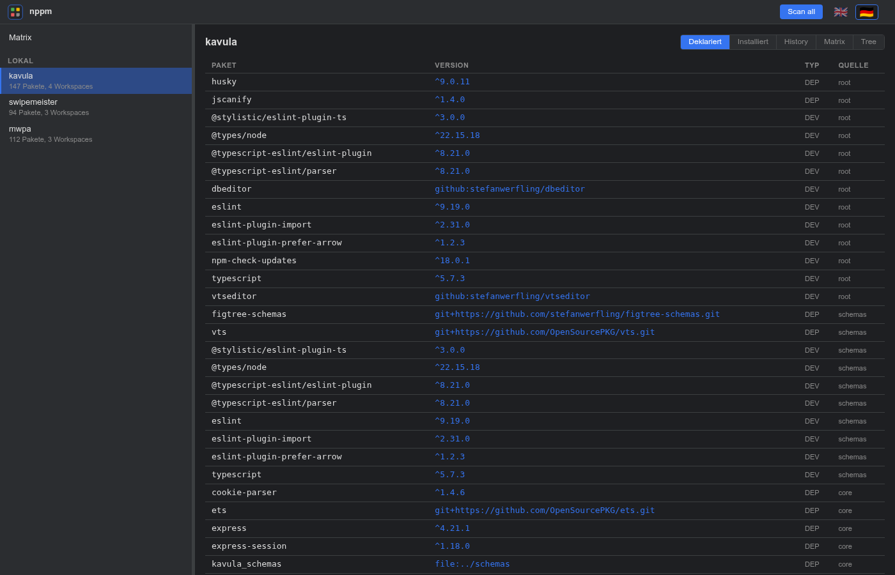
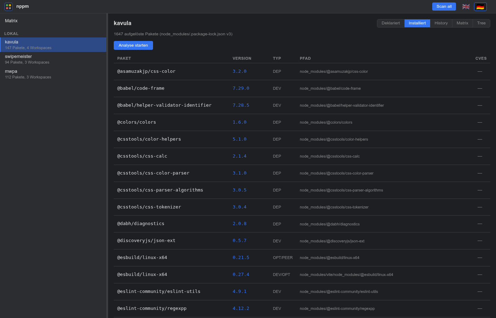
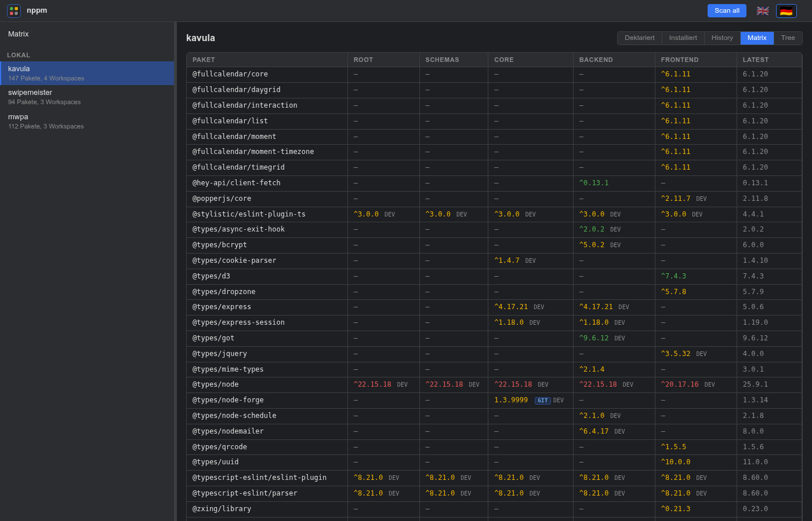
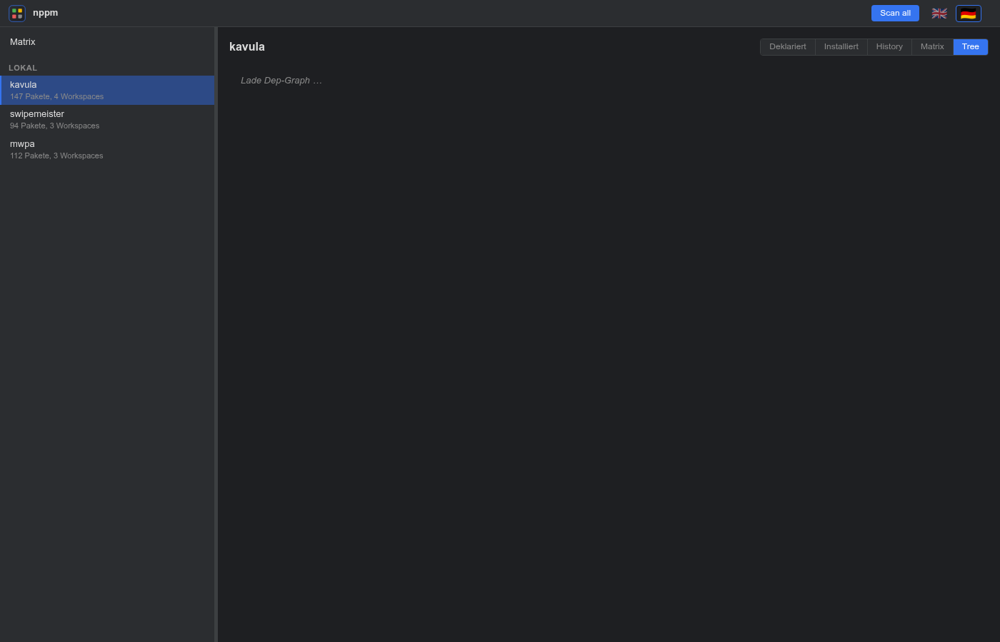
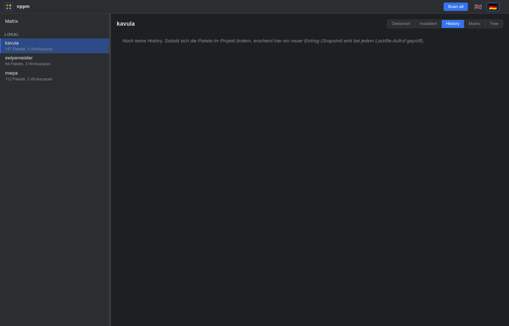
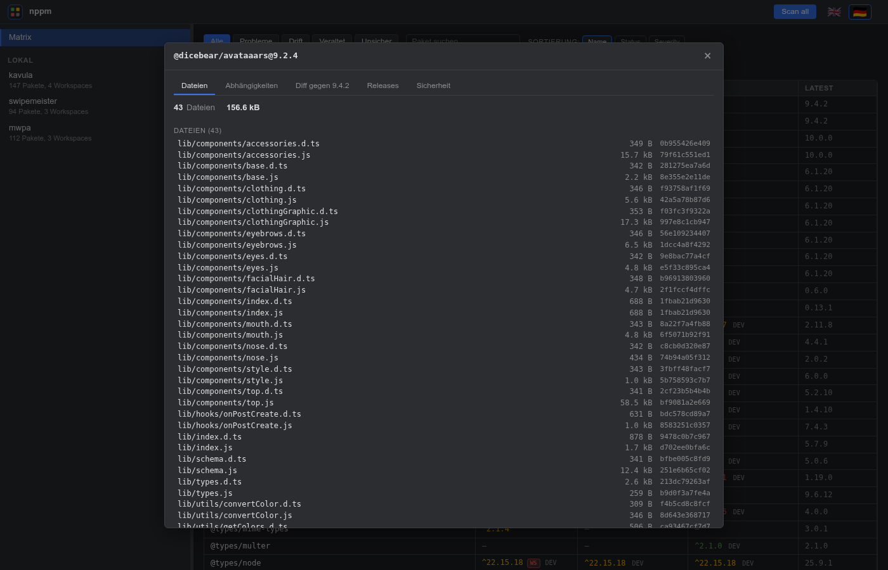
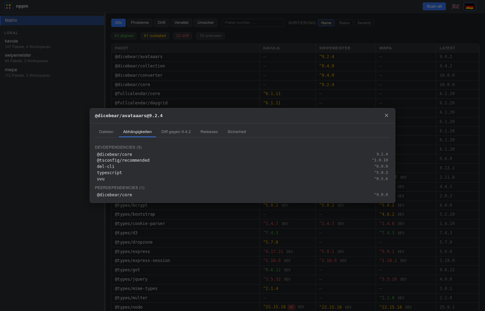
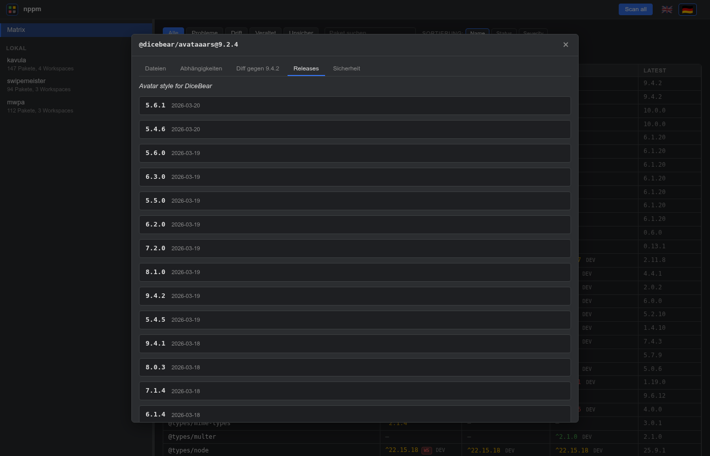
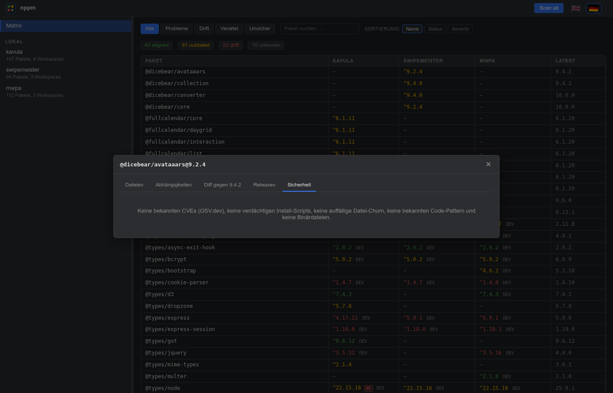

  

# nppm — Benutzerhandbuch

> 🇬🇧 English version: [`manual_en.md`](manual_en.md)

Dieses Handbuch beschreibt nppm anhand der Screenshots, die `npm run
docs:screenshots` aus deiner eigenen `nppm.json` erzeugt — d.h. du
siehst hier echte Daten aus deinen konfigurierten Projekten, nicht
Beispielprojekte.

## Inhalt

1. [Die projektübergreifende Matrix](#1-die-projektübergreifende-matrix)
2. [Ein Projekt im Detail](#2-ein-projekt-im-detail)
   - [Deklarierte Abhängigkeiten](#21-deklarierte-abhängigkeiten)
   - [Installierte Abhängigkeiten](#22-installierte-abhängigkeiten)
   - [Projekt-Matrix](#23-projekt-matrix)
   - [Abhängigkeitsbaum](#24-abhängigkeitsbaum)
   - [History](#25-history)
3. [Paket-Detail-Panel](#3-paket-detail-panel)
   - [Dateien](#31-dateien)
   - [Abhängigkeiten](#32-abhängigkeiten)
   - [Releases](#33-releases)
   - [Sicherheit](#34-sicherheit)
4. [Globaler CVE-Scan](#4-globaler-cve-scan)
5. [Sprache wechseln](#5-sprache-wechseln)

---

## 1. Die projektübergreifende Matrix

Die Einstiegsansicht. Zeilen sind **Pakete**, Spalten sind **Projekte**
plus eine **Latest**-Spalte aus dem npm-Registry. Die Zellenfarbe
zeigt den Zeilenstatus:

- 🟢 **aligned** — alle Projekte, die das Paket pinnen, benutzen den
  gleichen Range *und* der Range löst auf die Registry-Latest auf.
- 🟡 **outdated** — alle einig, aber die Registry hat eine neuere
  Version.
- 🔴 **drift** — mindestens zwei Projekte sind sich über die Version
  uneinig.
- ⚪ **unknown** — der Registry-Lookup ist fehlgeschlagen.

**Filter** oben links: `Alle / Probleme / Drift / Veraltet / Unsicher`.
Die **Suche** macht case-insensitive Substring-Matching auf den
Paketnamen. **Sortierung:** Name, Status (am dringlichsten zuerst)
oder aggregierter Security-Score.

**Badges in der Namensspalte:**

- `CVE N` — N bekannte OSV.dev-Schwachstellen in der Latest-Version.
- `SCRIPT` / `SCRIPT!` — Lifecycle-Scripts auf Warn-/Risk-Stufe.
- `EVAL N` — N dynamische Code-Ausführungs-Pattern im Tarball.
- `BIN N` — N native Binärdateien (`.exe / .dll / .so` …) im Tarball.
- `WS` — Workspaces *innerhalb* eines Projekts sind uneinig.

**Git-Dependencies** zeigen die *installierte* Version als Zellenwert
plus ein kleines `git`-Chip; im Hover erscheint die Original-URL.

Klick auf eine Zelle öffnet das
[Paket-Detail-Panel](#3-paket-detail-panel). Klick auf einen
Projekt-Spaltenkopf wechselt in das Projekt.

---

## 2. Ein Projekt im Detail

Wählt man im linken Treeview ein Projekt aus, landet man in einer
Fünf-Tab-Ansicht: **Deklariert / Installiert / History / Matrix /
Tree**. Der Toggle ist in jedem Tab gleich — Navigation ist immer ein
Klick weit weg.

### 2.1 Deklarierte Abhängigkeiten

Flache Tabelle aller Abhängigkeiten aus den `package.json`-Dateien
(Root + Workspaces) des Projekts.

### 2.2 Installierte Abhängigkeiten

Was npm tatsächlich auf der Platte aufgelöst hat. Die Anzeige nennt
die *Quelle* der Daten:

- **`package-lock.json v3`** — committed Lockfile (beste Datenqualität).
- **`node_modules/.package-lock.json v3`** — npm's versteckter Klon mit
  identischen Daten, wird bei jedem `npm install` geschrieben —
  Fallback wenn die committed Lockfile in `.gitignore` steht.
- **Aus node_modules synthetisiert** — Last-Resort-Walk wenn gar keine
  Lockfile existiert (ohne `dev` / `peer` / `optional`-Flags).

Der Button **Analyse starten** startet einen pro-Projekt-SSE-OSV-Scan;
die CVE-Spalte füllt sich zeilenweise während der Fortschrittsbalken
läuft.

### 2.3 Projekt-Matrix

Gleiche Form wie die globale Matrix, aber die Spalten sind die
*Workspaces* des Projekts statt anderer Projekte. Nützlich wenn die
Workspaces eines einzelnen Projekts uneins sind.

### 2.4 Abhängigkeitsbaum

D3 collapsible Tree. Root = das Projekt, Kinder = Top-Level-Deps;
Klick auf einen Knoten lädt seine Sub-Abhängigkeiten on-demand.
Knotenfarbe folgt der Status-Semantik; ein umrandeter Knoten hat noch
versteckte Kinder.

### 2.5 History

Bei jedem Lockfile-Aufruf vergleicht nppm den aktuellen Stand mit dem
letzten Snapshot und fügt einen History-Eintrag hinzu, wenn sich etwas
geändert hat. Das Reason-Feld wird automatisch aus dem Semver-Bump-Typ
generiert, mit CVE-Hinweis wenn die alte Version bekannte
Schwachstellen im OSV-Cache hatte.

Die History-Dateien liegen in `.nppm-history/` neben deiner
`nppm.json` — kannst du committen, wenn du langfristige Audit-Spuren
willst.

---

## 3. Paket-Detail-Panel

Klick auf eine Matrix-Zelle öffnet ein Modal mit fünf Tabs.

### 3.1 Dateien

Pro Datei im Tarball: SHA-256 + Größe. Im Header steht die
Gesamtanzahl + Bytes.

### 3.2 Abhängigkeiten

Was das Paket selbst als `dependencies`, `devDependencies`,
`peerDependencies`, `optionalDependencies` deklariert. Aus der
`package.json` im Tarball gelesen (permanent gecached).

### 3.3 Diff

Vergleicht die Cell-Version mit der Registry-Latest, Datei für Datei:
hinzugefügt / entfernt / geändert. Lazy-loaded beim ersten Tab-Klick.

### 3.4 Releases

Zusammengeführte Zeitleiste:

- npm-Publish-Daten (immer verfügbar)
- GitHub-Release-Titel + Body-Notes (wenn das `repository`-Feld des
  Pakets auf github.com zeigt)

Der Pfeil rechts ist ein direkter Link zur GitHub-Release-Seite. Setze
`GH_TOKEN` in deinem `.env`, um das 60-req/h-Anonymous-Rate-Limit
loszuwerden.

### 3.5 Sicherheit

Aggregiert fünf Scanner:

- **CVEs** aus OSV.dev (Single-Version-Query, volle Details)
- **Install-Scripts** — Lifecycle-Hooks klassifiziert info/warn/risk
- **Code-Pattern** — `eval(`, `new Function(`, `child_process`, base64
- **Binärdateien** — nativer Code im Tarball
- **Datei-Churn** — Vergleich gegen die vorherige Stable-Version

Bei Git-Dependencies erscheint ein "Git-Paket"-Hinweis, weil OSV nur
Registry-Versionen indiziert — die anderen Scanner laufen trotzdem
normal.

---

## 4. Globaler CVE-Scan

Der **Alle scannen**-Button in der Topbar startet einen SSE-Stream
über die Lockfiles aller konfigurierten Projekte, dedupliziert
`name@version` über die ganze Range und fragt OSV in Chunks von 50.
Der Topbar-Fortschrittsbalken zeigt Sammel- und OSV-Phase.

Die Ergebnisse landen in einem eigenen rechten Pane: jede eindeutige
`name@version`-Kombination über alle Projekte, mit Vuln-Anzahl und der
Liste der Projekte, die das Paket benutzen. Die Checkbox **nur
Treffer** filtert auf Zeilen mit bekannten CVEs.

Ein zweiter Scan ist instant für jedes `pkg@version`, das schon im
OSV-Cache liegt — nur neue Einträge kosten Netzwerk.

---

## 5. Sprache wechseln

Die Flaggen oben rechts schalten die UI-Sprache. Default ist Englisch,
Deutsch ist mitgeliefert. Eine dritte Sprache hinzufügen ist ein
Drei-Schritt-Edit — siehe [`CLAUDE.md`](../CLAUDE.md) für die
Anleitung.

Die Sprachwahl wird in `localStorage` (`nppm.lang`) gemerkt und beim
nächsten Page-Load wirksam.