<p align="center">
  
</p>

# nppm — Benutzerhandbuch

> 🇬🇧 English version: [`manual_en.md`](manual_en.md)

Dieses Handbuch beschreibt nppm anhand der Screenshots, die `npm run
docs:screenshots` aus deiner eigenen `nppm.json` erzeugt — d.h. du
siehst hier echte Daten aus deinen konfigurierten Projekten, nicht
Beispielprojekte.

<p align="center">
  
</p>

> **git + npm — die beste Kombination.** nppm zieht seine Stärke aus
> beiden Datenquellen gleichzeitig: das **npm-Registry** liefert
> Versionen, Publisher, Integrity, Provenance und CVE-Verknüpfungen
> für jedes Paket; **git** liefert die zeitliche Achse — welcher
> Lockfile-Stand zu welchem Commit gehörte. Erst die Verschränkung
> aus beiden erlaubt Features wie die retroaktive
> Vulnerability-Timeline, PR-Review-Deltas und die git-rückwärts
> rekonstruierte History. Ein lokales nppm-Projekt sollte deswegen
> idealerweise sowohl in git versioniert sein als auch über
> `package-lock.json` reproduzierbar installieren.

## Inhalt

1. [Die projektübergreifende Matrix](#1-die-projektübergreifende-matrix)
2. [Ein Projekt im Detail](#2-ein-projekt-im-detail)
   - [Deklarierte Abhängigkeiten](#21-deklarierte-abhängigkeiten)
   - [Installierte Abhängigkeiten](#22-installierte-abhängigkeiten)
   - [Projekt-Matrix](#23-projekt-matrix)
   - [Abhängigkeitsbaum](#24-abhängigkeitsbaum)
   - [History](#25-history)
   - [Unbenutzte Abhängigkeiten](#26-unbenutzte-abhängigkeiten)
3. [Paket-Detail-Panel](#3-paket-detail-panel)
   - [Dateien](#31-dateien)
   - [Abhängigkeiten](#32-abhängigkeiten)
   - [Releases](#33-releases)
   - [Sicherheit](#34-sicherheit)
   - [Lizenz](#36-lizenz)
4. [Globaler CVE-Scan](#4-globaler-cve-scan)
5. [Headless-CI-Modus](#5-headless-ci-modus)
6. [SBOM-Export](#6-sbom-export)
7. [Eine Abhängigkeit upgraden (Upgrade-Modal)](#7-eine-abhängigkeit-upgraden-upgrade-modal)
8. [Bulk-Update-Wizard](#8-bulk-update-wizard)
9. [Vulnerability-Timeline](#9-vulnerability-timeline)
10. [PR-Review](#10-pr-review)
11. [Sprache wechseln](#11-sprache-wechseln)
12. [Templates (Standards-Enforcement)](#12-templates-standards-enforcement)
13. [Einstellungen + Cache neu aufbauen](#13-einstellungen--cache-neu-aufbauen)
14. [Workspace-Drift-Drill-Down](#14-workspace-drift-drill-down)
15. [Health-Ring pro Projekt](#15-health-ring-pro-projekt)
16. [Projektübergreifendes Dashboard](#16-projektübergreifendes-dashboard)
17. [Impact-Analyse](#17-impact-analyse)
18. [Badge-Filter](#18-badge-filter)

---

## 1. Die projektübergreifende Matrix

Die Einstiegsansicht. Zeilen sind **Pakete**, Spalten sind **Projekte**
plus eine **Latest**-Spalte aus dem npm-Registry. Die Zellenfarbe
zeigt den Zeilenstatus:

- 🟢 **aligned** — alle Projekte, die das Paket pinnen, benutzen den
  gleichen Range *und* der Range löst auf die Registry-Latest auf.
- 🟡 **outdated** — alle einig, aber die Registry hat eine neuere
  Version.
- 🔴 **drift** — mindestens zwei Projekte sind sich über die Version
  uneinig.
- ⚪ **unknown** — der Registry-Lookup ist fehlgeschlagen.


**Filter** oben links: `Alle / Probleme / Drift / Veraltet / Unsicher /
Lizenzen` (letzterer zeigt nur Pakete mit Strong-Copyleft, proprietärer
oder unbekannter Lizenz).
Die **Suche** macht case-insensitive Substring-Matching auf den
Paketnamen. **Sortierung:** Name, Status (am dringlichsten zuerst)
oder aggregierter Security-Score.

**Badges in der Namensspalte:**

- `CVE N` — N bekannte OSV.dev-Schwachstellen in der Latest-Version.
- `SCRIPT` / `SCRIPT!` — Lifecycle-Scripts auf Warn-/Risk-Stufe.
- `EVAL N` — N dynamische Code-Ausführungs-Pattern im Tarball.
- `BIN N` — N native Binärdateien (`.exe / .dll / .so` …) im Tarball.
- `OWNER!` — Schneller Owner-Wechsel auf einem etablierten Paket
  (klassisches Account-Takeover-Profil — siehe Maintainer-Scanner unten).
- `GPL` / `UNLIC` / `LIC?` — Lizenz-Klassifikation: Strong-Copyleft /
  proprietär / unbekannt (siehe Lizenz-Tab unten).
- `PROV ✓` — grünes Positiv-Badge: Latest-Version wurde mit
  `--provenance` veröffentlicht (Sigstore-verankerte CI-Attestation).
- `NEW!` / `NEW` — brandneues Paket oder Publisher (< 7 Tage / < 30
  Tage). Klassisches Typosquat-Profil wenn beide Signale feuern.
- `STALE!` / `STALE` — Paket wirkt verlassen (≥ 730 Tage / ≥ 180
  Tage seit dem letzten Release).
- `SQUAT!` / `SQUAT?` — Name ist Levenshtein-1 von einem populären
  Paket entfernt ODER enthält Unicode-Verwechsler / Levenshtein-2-
  Lookalike.
- `EXT!` / `EXT?` — External-Source-Aggregator (socket.dev /
  OpenSSF Scorecard / deps.dev) hat das Paket markiert —
  worst-of-three.
- `DEP!` / `DEP?` — installierte Version wurde vom Maintainer
  deprecated (risk) oder Registry-`latest` ist deprecated (warn).
  Hover zeigt die Begründung des Maintainers.
- `OBF!` / `OBF?` — JS-Datei im Tarball wirkt absichtlich obfuskiert
  (`eval(atob(…))` / `_0x`-Dichte / Hex-String-Arrays / lange
  Zeilen außerhalb von `dist/min/`).
- `MAN!` / `MAN?` — Manifest-Red-Flags stapeln sich: fehlende
  README / Description / `files[]`, viele `bin`-Einträge, die
  Native-Build + Postinstall-Kombi, veraltete `engines.node`.
- `CAP!` / `CAP?` — gefährliche Capability-Kombinationen
  (`child_process` + Network / Env + Network / Native + Network).
  Einzelne Capability bleibt stumm.
- `INT!` — Lockfile-Integrity-Hash weicht von der Registry ab
  (möglicher Mirror-Hijack).
- `WS` — Workspaces *innerhalb* eines Projekts sind uneinig. Ein
  Klick öffnet den [Workspace-Drift-Drill-Down](#14-workspace-drift-drill-down).

Klick auf ein Badge öffnet das
[Paket-Detail-Panel](#3-paket-detail-panel) auf dem Sicherheits-Tab.

Der **Badges**-Button in der Toolbar öffnet ein Modal, in dem
einzelne Badge-Familien ausgeblendet werden können — siehe
[§18 Badge-Filter](#18-badge-filter).

**Git-Dependencies** zeigen die *installierte* Version als Zellenwert
plus ein kleines `git`-Chip; im Hover erscheint die Original-URL. Die
**Latest**-Spalte für Zeilen, in denen *jede* Deklaration eine git-URL
ist, zeigt den Upstream-HEAD als `1.0.28 · 7d3f12a` — die
`package.json.version` aus dem HEAD-Tarball plus die kurze Commit-SHA
— für GitHub- und Gitea-Hosts. Das gleichnamige npm-Paket gilt als
unverwandt, deshalb werden Cadence- / Freshness- / Maintainer- /
CVE- / Bundle- / Lizenz- / Provenance- / Typosquat-Scans
übersprungen, um keine fremden Daten dem Repo zuzuschreiben. Wenn
der Host nicht erreichbar ist, fällt die Zelle auf das schlichte
`git`-Pill zurück und eine orange ⓘ daneben trägt den rohen Fehler
("GitHub unreachable: …" / "Repository not found on GitHub") im
Tooltip. Unbekannte Hosts bleiben stumm (kein Icon).

Klick auf eine Zelle öffnet das
[Paket-Detail-Panel](#3-paket-detail-panel). Klick auf einen
Projekt-Spaltenkopf wechselt in das Projekt.

---

## 2. Ein Projekt im Detail

Wählt man im linken Treeview ein Projekt aus, landet man in einer
Acht-Tab-Ansicht: **Deklariert / Installiert / History / Matrix /
Tree / Unbenutzt / Vulns / PR**. Der Toggle ist in jedem Tab gleich —
Navigation ist immer ein Klick weit weg.

### 2.1 Deklarierte Abhängigkeiten

Flache Tabelle aller Abhängigkeiten aus den `package.json`-Dateien
(Root + Workspaces) des Projekts.


### 2.2 Installierte Abhängigkeiten

Jede Zeile bekommt in der Pfad-Spalte einen kleinen **`IDE`**-Button,
sobald `actions.editor` in `nppm.json` gesetzt ist. Klick öffnet
`node_modules/<pkg>` im konfigurierten Editor über dessen
URL-Handler (`vscode://`, `vscodium://`, `cursor://`, `phpstorm://`,
`webstorm://`, `idea://`, `subl://`). Bei Remote-Projekten
ausgeblendet (die Dateien liegen ja nicht lokal) und wenn kein Editor
konfiguriert ist.

Was npm tatsächlich auf der Platte aufgelöst hat. Die Anzeige nennt
die *Quelle* der Daten:

- **`package-lock.json v3`** — committed Lockfile (beste Datenqualität).
- **`node_modules/.package-lock.json v3`** — npm's versteckter Klon mit
  identischen Daten, wird bei jedem `npm install` geschrieben —
  Fallback wenn die committed Lockfile in `.gitignore` steht.
- **Aus node_modules synthetisiert** — Last-Resort-Walk wenn gar keine
  Lockfile existiert (ohne `dev` / `peer` / `optional`-Flags).


**Integrity-Spalte:** wird beim Laden automatisch befüllt — kein
Knopf nötig. Pro Zeile:

- `✓` — Lockfile `integrity + resolved` stimmen mit dem überein, was
  das npm-Registry aktuell ausliefert (der Normalfall).
- `mismatch` (rot) — das Registry liefert jetzt einen anderen SRI-Hash
  als die Lockfile festgenagelt hat. Möglicher Mirror-Hijack,
  Dependency-Confusion oder von Hand editierte Lockfile. Hover für
  Side-by-Side der beiden Hashes.
- `mirror` (grau) — `resolved`-URL zeigt off-Registry, aber Integrity
  passt. Harmloser Custom-Mirror.
- `no-hash` (grau) — Lockfile-Eintrag hat keinen Integrity-Wert (alte
  npm-Version, Hand-Edit, Git-Dep).
- `private` (grau) — Registry kennt das Paket nicht. Privat /
  unveröffentlicht / intern.
- `—` (gedämpft) — Registry-Cache ist noch leer; einmal die
  Deklariert-Ansicht öffnen oder einen Scan starten, um ihn zu
  füllen.

Eine Summary-Pille (`Integrity: 1 mismatch · 3 info`) erscheint neben
der Meta-Zeile, wenn der Scan etwas Nicht-Triviales findet — saubere
Projekte bleiben still. Der gesamte Check ist offline gegen den
bestehenden Registry-Cache (den der Deklariert-Tab + Global-Scan
ohnehin füllen).

Der Button **Analyse starten** startet einen pro-Projekt-SSE-OSV-Scan;
die CVE-Spalte füllt sich zeilenweise während der Fortschrittsbalken
läuft.

### 2.3 Projekt-Matrix

Gleiche Form wie die globale Matrix, aber die Spalten sind die
*Workspaces* des Projekts statt anderer Projekte. Nützlich wenn die
Workspaces eines einzelnen Projekts uneins sind.


Der gleiche Git-Only-Latest-Guard wie in der projektübergreifenden
Matrix läuft auch hier: Zeilen, in denen jeder Workspace die Dep
per git-URL deklariert, bekommen `latest=null` plus den
Upstream-HEAD-Stempel (`1.0.28 · 7d3f12a` von GitHub / Gitea); die
ⓘ neben dem Pill trägt jeden HEAD-Fetch-Fehler. Bei Remote-
Projekten (GitHub / Gitea) ist der Upgrade-`↑`-Button ausgeblendet
und oben im View sitzt ein kleines "Read-only: Remote-Projekt —
Upgrades und Template-Apply sind deaktiviert."-Banner, damit der
fehlende Button nicht wie ein Bug wirkt.

### 2.4 Abhängigkeitsbaum

D3 collapsible Tree. Root = das Projekt, Kinder = Top-Level-Deps;
Klick auf einen Knoten lädt seine Sub-Abhängigkeiten on-demand.
Knotenfarbe folgt der Status-Semantik; ein umrandeter Knoten hat noch
versteckte Kinder.


**Manifest-Fallback.** Projekte ohne committed
`package-lock.json` (üblich bei Browser-Extensions und vielen
Libraries) bekommen statt eines 404 einen flachen Baum, der aus
den deklarierten Root-Deps der `package.json` synthetisiert
wird: jeder Top-Level-Eintrag trägt seinen deklarierten Range
als Versions-String und das Registry-`latest`, ohne Kinder.
Eine einzeilige Banner-Notiz über dem Baum weist auf den
Fallback hin, damit das leere `deps[]` nicht als "dieses Projekt
hat keine transitiven Deps" missverstanden wird. Eine Lockfile
committen, um den vollen transitiven Graph zu sehen.

### 2.5 History

Bei jedem Lockfile-Aufruf vergleicht nppm den aktuellen Stand mit dem
letzten Snapshot und fügt einen History-Eintrag hinzu, wenn sich etwas
geändert hat. Das Reason-Feld wird automatisch aus dem Semver-Bump-Typ
generiert, mit CVE-Hinweis wenn die alte Version bekannte
Schwachstellen im OSV-Cache hatte.


Die Einträge werden als vertikale Timeline gerendert. Jedes Datum
bekommt seinen eigenen Pill am Gruppenkopf; jeder Eintrag hat ein
farbiges Icon auf der Spur — `+` (grün) für reine Adds, `~` (gelb)
für reine Updates, `−` (rot) für reine Removes, `●` (Akzent) für
gemischte Änderungen. Die History-Dateien liegen in `.nppm-history/`
neben deiner `nppm.json` — kannst du committen, wenn du langfristige
Audit-Spuren willst.

**Git-Backfill.** Die Scan-Leiste oberhalb der Timeline trägt einen
`Aus git nachpflegen`-Button (deaktiviert, wenn für das Projekt keine
`.git/`-Quelle erkannt wird). Ein Klick walkt bei lokalen Projekten
`git log -- package-lock.json` (bzw. die entsprechende Commits-API
für GitHub-/Gitea-Quellen) und rekonstruiert die vollständige
Dependency-History rückwirkend — ein Eintrag pro Commit, der die
Lockfile angefasst hat, mit echtem Commit-SHA + Author-Zeitstempel.
Wenn nie eine Lockfile committed wurde, fällt der Walker auf
`git log -- package.json` zurück und trackt stattdessen die
deklarierten Range-Änderungen; diese Einträge bekommen in der
History-Ansicht eine gelbe `nur-deklariert`-Pille, weil die
Versions-Strings Ranges (`^4.0.0`) und keine konkreten Versionen
sind — die Vulns-Ansicht kann sie nicht OSV-querien.

Der Status-Pill neben dem Button zeigt, ob ein Backfill bereits
gelaufen ist (`git-History rekonstruiert aus <sha>`) oder noch
aussteht (`git-History noch nicht rekonstruiert — Scan starten`).
Erneutes Nachpflegen ist günstig: idempotent über die HEAD-SHA, es
werden nur neue Commits verarbeitet. Der Backfill läuft zusätzlich
transparent beim ersten Öffnen der Vulns-Ansicht — wenn du nur die
History gefüllt haben willst (ohne OSV-Nachholjagd), ist der Button
in der History-Ansicht der schnellere Weg.

### 2.6 Unbenutzte Abhängigkeiten

Ein depcheck-artiger Hygiene-Scan über den Quellbaum des Projekts.
Der Tab gruppiert die Befunde in drei Listen:

- **Unbenutzt** — in `package.json` deklariert, aber nirgends unter
  `src/` importiert. Severity ist `risk` für echte Kandidaten und
  `info` für Einträge, die der Scanner bewusst verschont (Allowlist /
  `scripts:`-Referenz / `@types/X` deren `X` importiert wird).
- **Falsch einsortiert** — nur aus Dev-Pfaden importiert (`*.test.*`,
  `*.spec.*`, `tests/`, `*.config.*`), steht aber in `dependencies`
  statt `devDependencies`. Fix ist ein `package.json`-Edit.
- **Fehlend** — wird aus dem Quellcode importiert, ist aber nirgends
  deklariert. Meist ein transitiv geleakter Import, manchmal eine
  vergessene Peer-Dep.

Der Scanner arbeitet rein per Regex (kein AST-Parse). Dynamische
Specs wie `import(varName)` können nicht aufgelöst werden; betroffene
Dateien werden separat aufgeführt, damit die Unused-Liste dort nicht
als endgültig missverstanden wird.

Eine Default-Allowlist deckt die Bin-Tools ab, die fast jedes
npm-Projekt in `devDependencies` führt (`vite`, `vitest`, `tsx`,
`typescript`, `eslint`, `prettier`, `husky`, `rimraf`, `cross-env`, …)
plus den bekannten `tsc → typescript`-Bin-Alias. Eigene Extras
ergänzt man über `security.unused.allowlist` in `nppm.json` — die
Default-Liste wird *vereinigt*, nicht ersetzt, damit ein Ein-Zeilen-
Override nicht eine Welle falscher Treffer zurückbringt.

Remote-Projekte (GitHub / Gitea) zeigen aktuell "nicht unterstützt"
an, weil der contents-API-Aufruf pro Datei in v1 das Rate-Limit-
Budget sprengen würde.

---

## 3. Paket-Detail-Panel

Klick auf eine Matrix-Zelle öffnet ein Modal mit fünf Tabs.

### 3.1 Dateien

Pro Datei im Tarball: SHA-256 + Größe. Im Header steht die
Gesamtanzahl + Bytes.


### 3.2 Abhängigkeiten

Was das Paket selbst als `dependencies`, `devDependencies`,
`peerDependencies`, `optionalDependencies` deklariert. Aus der
`package.json` im Tarball gelesen (permanent gecached).


### 3.3 Diff

Vergleicht die Cell-Version mit der Registry-Latest, Datei für Datei:
hinzugefügt / entfernt / geändert. Lazy-loaded beim ersten Tab-Klick.

Bei **Git-Dependencies** mit einem fixierten `#ref`
(`git+https://…#v1.2.3`, `github:owner/repo#abc1234`) vergleicht
der Tab den gepinnten Tarball gegen den Upstream-HEAD. Nicht-
SHA-fixierte Koordinaten (Branches / Tags) umgehen den permanenten
Fingerprint-Cache, damit HEAD-Inhalt nie veraltet ausgeliefert
wird. Unpinned git-URLs deaktivieren den Tab weiterhin — es gibt
keine zweite Koordinate zum Diffen.

### 3.4 Releases

Zusammengeführte Zeitleiste. Registry-veröffentlichte Pakete
zeigen:

- npm-Publish-Daten (immer verfügbar)
- Publisher (`_npmUser`) pro Version — `by <name>` hinter dem Datum,
  damit du Owner-Wechsel direkt am Versionsverlauf siehst.
- GitHub-Release-Titel + Body-Notes (wenn das `repository`-Feld des
  Pakets auf github.com zeigt)

**Git-Dependencies** routen über die Commits-API des Hosts
(GitHub REST, Gitea v1 mit dem per-Instanz-Token) und rendern
jeden Commit im selben Release-Card-Format: SHA, Subject, Author.
Bis zu 50 Einträge, neueste zuerst.

Beide Modi starten eingeklappt mit fünf Karten plus einem
"Alle laden (N)"-Button unten — `lodash` hat 60+ Versionen, und
den Nutzer jedes Mal durch alle scrollen zu lassen unterläuft den
Sinn. Beim Öffnen eines anderen Pakets startet die Ansicht wieder
eingeklappt.

Der Pfeil rechts ist ein direkter Link zur GitHub-Release-Seite. Setze
`GH_TOKEN` in deinem `.env`, um das 60-req/h-Anonymous-Rate-Limit
loszuwerden.


### 3.5 Sicherheit

Aggregiert die volle Scanner-Familie als einklappbare Karten
(Lizenz hat einen eigenen Tab — siehe 3.6). Standard: jede Karte
eingeklappt, sofern sie keine warn/risk-Befunde trägt. Ein
sauberes Paket zeigt also ein Banner + einen Stapel gefalteter
Karten; ein problematisches öffnet die relevanten von selbst.

- **CVEs** aus OSV.dev (Single-Version-Query, volle Details)
- **Install-Scripts** — Lifecycle-Hooks klassifiziert info/warn/risk
- **Code-Pattern** — `eval(`, `new Function(`, `child_process`,
  base64, Webhook-URLs, credential-artige Env-Reads,
  `_0x`-Obfuskator-Fingerprint
- **Binärdateien** — nativer Code im Tarball
- **Datei-Churn** — Vergleich gegen die vorherige Stable-Version
- **Maintainer / Publisher** — vergleicht den `_npmUser` der gewählten
  Version mit dem Trust-Set der letzten Vorgänger.
- **Provenance / Signatur** — Sigstore-Attestation +
  npm-Schlüssel-Signaturen. Drei Stufen: `provenance`
  (Sigstore-attested), `signed` (Registry-Baseline), `unsigned`
  (sehr alte Releases oder non-npm Mirrors).
- **Frische** — Paketalter (`time.created`) + Publisher-Account-
  Alter. Worst-of-two: `risk` (< 7 d) / `warn` (< 30 d) / `info`.
- **Release-Kadenz** — Tage seit letztem Release + Median-Gap der
  letzten 10 Versionen. `risk` = verlassen, `warn` = ausbremsend.
- **Typosquat / Homoglyph** — Levenshtein-Distanz + Unicode-
  Verwechsler gegen eine kuratierte Popular-Package-Liste.
- **Deprecation** — liest per-Version `deprecated` aus dem
  Packument. Zeigt den Maintainer-Hinweis wortwörtlich
  ("use foo@2 instead" o.ä.).
- **Obfuskation** — Per-JS-Datei-Befundliste: `path`, Signale
  (`eval-decoded` / `obfuscator-io-identifier` /
  `hex-string-array` / `long-line` / `dense-hex-literals`) und
  ein kurzes Detail (max. Zeilenlänge, `_0x`-Dichte, …).
  Build-Artefakte (`dist/`, `*.min.js`, …) werden erkannt und auf
  info gedeckelt — legitime Minification verzerrt das Ergebnis
  nicht.
- **Manifest-Red-Flags** — `package.json`-Heuristiken: fehlende
  README / Description / `files`-Allowlist, viele `bin`-Einträge,
  Native-Build + Postinstall-Kombi, veraltete `engines.node`.
  Stufung: 1 Flag = info, 2 = warn, 3 oder die bösartige Kombi =
  risk.
- **Capability-Inventar** — welche Plattform-APIs die JS-Dateien
  berühren. Risk entsteht aus *Kombinationen* (spawn + Network,
  env-read + Network, native + Network); einzelne Capability
  bleibt info.
- **Externe Quellen** — drei Unterabschnitte (socket.dev /
  OpenSSF Scorecard / deps.dev) jeweils mit Score, Deep-Link und
  source-spezifischer Begründung. Standardmäßig aus für socket
  (braucht API-Key); OpenSSF + deps.dev sind frei und
  standardmäßig an.

Die Severity beim Maintainer-Scanner orientiert sich an der **Geschwindigkeit
des Owner-Wechsels** auf einem etablierten Paket — empirisch hatten die
echten npm-Account-Takeovers (event-stream, ua-parser-js, coa, rc,
@solana/web3.js) kurze Gaps:

| Gap zur Vorversion | Severity |
|--------------------|----------|
| ≤ 30 Tage + ≥10 Vorgänger | `risk` — Takeover-Profil |
| 31 – 180 Tage + ≥10 Vorgänger | `warn` — ungewöhnlich, Blick lohnt sich |
| > 180 Tage | `info` — wahrscheinlich legitime Community-Übernahme eines verlassenen Pakets |

Schwellen sind in `nppm.json` unter `security.maintainer.{quickHandoverDays,
suspiciousGapDays,matureVersions,trustWindow}` konfigurierbar.

Wenn `Maintainer = risk` **und** `Churn = warn/risk` für dieselbe
Version zusammenkommen, blendet das Panel oben einen roten **"Möglicher
Supply-Chain-Angriff"**-Banner ein — das ist das Muster, das die
genannten realen Takeovers gemeinsam hatten.

Bei Git-Dependencies erscheint ein "Git-Paket"-Hinweis, weil OSV nur
Registry-Versionen indiziert — die anderen Scanner laufen trotzdem
normal.


### 3.6 Lizenz

Eigener Tab für Compliance-Fragen. Klassifiziert das `license`-Feld des
Pakets in fünf Buckets:

| Bucket | Beispiele | Bedeutung |
|--------|-----------|-----------|
| `permissive` | MIT, Apache-2.0, BSD-*, ISC | Keine Auflagen |
| `weak-copyleft` | LGPL-*, MPL-2.0, EPL-2.0 | Datei-Grenze, meist akzeptiert |
| `strong-copyleft` | GPL-*, AGPL-* | Viral, Code-Freigabe für Derivate |
| `proprietary` | `UNLICENSED`, `SEE LICENSE IN …` | Keine Weitergabe ohne Vertrag |
| `unknown` | nicht im SPDX-Katalog | Nicht klassifizierbar — manueller Check |

Ein Mini-SPDX-Parser handhabt Ausdrücke wie `(MIT OR Apache-2.0)` (bei
OR gewinnt der erlaubteste Bucket — der Nutzer darf wählen) und
`MIT AND GPL-3.0` (bei AND der restriktivste — alle Auflagen gelten).
`WITH`-Klauseln (`Apache-2.0 WITH Classpath-exception-2.0`) ändern den
Bucket nicht.

Zusätzlich listet der Tab die **tatsächlich im Tarball mitgelieferten
`LICENSE*` / `COPYING*`-Dateien** auf — ein Cross-Check gegen die
Selbstauskunft im `package.json`.

**Policy in `nppm.json`:**

```json
"security": {
  "license": {
    "allowlist": ["MIT", "Apache-2.0", "BSD-*", "ISC"],
    "denylist": ["AGPL-*"],
    "treatUnknownAs": "proprietary"
  }
}
```

`allowlist` überschreibt den Bucket auf `permissive`, `denylist` auf
`proprietary` (denylist gewinnt bei Konflikt). `treatUnknownAs:
"proprietary"` zwingt jedes Paket ohne erkannte Lizenz in den manuellen
Review.

### 3.7 Trends

Pro-Paket-Verlauf — fünf gestapelte SVG-Sub-Charts, alle aus
Daten gerendert, die schon im Packument-Cache liegen (kein
zusätzlicher HTTP für die ersten vier; nur die Downloads-Linie
holt einmalig `/downloads/range/last-year/<pkg>`, 24h gecached):

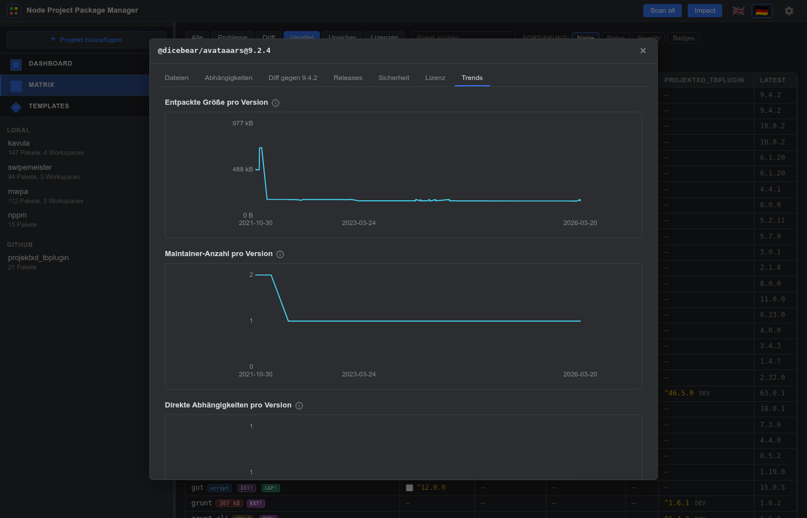

- **Größe pro Version** — Linie, X = Release-Datum, Y =
  `dist.unpackedSize`. Macht sichtbar, wann ein Paket aufgebläht
  wurde.
- **Maintainer-Anzahl pro Version** — Linie über `maintainers[].length`.
  Typische Trajektorie ist Solo-Autor → Community-Handover →
  Contributor-Peak; ein plötzlicher Sprung von 5 auf 1 direkt vor
  einem Takeover-Incident ist genau das Muster, das hier auffällt.
- **Direkte Abhängigkeiten pro Version** — Linie über
  `Object.keys(dependencies).length`. Ein Sprung nach oben ist der
  klassische "stabiles Utility hat heimlich ein Framework
  geschluckt"-Geruch.
- **Releases pro Monat** — Bar-Chart, letzte 24 Monate, mit Null-
  Backfill für lückenlose Cadence-Lesbarkeit.
- **Tägliche Downloads (letztes Jahr)** — Linie aus der npm-
  Public-Downloads-API. Punkte werden ab >60 Datenpunkten
  weggelassen (sonst unlesbar), die Linie alleine trägt die
  Story.

Sehr alte Releases (vor ~2016) tragen oft kein `unpackedSize` und
keine `maintainers[]`-Liste — die entsprechenden Punkte fallen
sauber raus statt mit `0` zu lügen.

---

## 4. Globaler CVE-Scan

Der **Alle scannen**-Button in der Topbar startet einen SSE-Stream
über die Lockfiles aller konfigurierten Projekte, dedupliziert
`name@version` über die ganze Range und fragt OSV in Chunks von 50.
Der Topbar-Fortschrittsbalken zeigt Sammel- und OSV-Phase.

Die Ergebnisse landen in einem eigenen rechten Pane: jede eindeutige
`name@version`-Kombination über alle Projekte, mit Vuln-Anzahl und der
Liste der Projekte, die das Paket benutzen. Die Checkbox **nur
Treffer** filtert auf Zeilen mit bekannten CVEs.

Ein zweiter Scan ist instant für jedes `pkg@version`, das schon im
OSV-Cache liegt — nur neue Einträge kosten Netzwerk.

---

## 5. Headless-CI-Modus

`nppm scan` ist das gleiche Set an Scannern wie der Dev-Server, nur
nicht-interaktiv — zum Einklinken in eine CI-Pipeline.

```sh
nppm scan                              # alles, fail bei risk
nppm scan --project=alpha --json       # ein Projekt, maschinenlesbar
nppm scan --fail-on=warn               # strengeres Gate
nppm scan --no-osv --no-heuristics     # offline / ohne Lockfile-Sicht
```

Was der Lauf pro Projekt (bzw. pro `--project=…`-Auswahl) macht:

1. Lockfile lesen, `name@version` deduplizieren.
2. CVE-IDs bei OSV.dev abrufen (außer `--no-osv`).
3. Heuristik-Batch — Scripts / Patterns / Binaries / Maintainer /
   Lizenz — über denselben Fingerprint-Cache laufen lassen, den auch
   der Dev-Server befüllt (außer `--no-heuristics`).
4. Unused-Deps-Detektor laufen lassen (außer `--no-unused`).

Jede einzelne Scanner-Severity wird auf eine gemeinsame
`info / warn / risk`-Skala abgebildet; `--fail-on=<level>` setzt die
Schwelle für einen Non-Zero-Exit. Lizenzklassen falten dazu:
`permissive` schweigt, `weak-copyleft` und `unknown` werden zu `info`,
`strong-copyleft` zu `warn`, `proprietary` zu `risk`. OSV-Vulns sind
einheitlich `risk` (entspricht `npm audit --audit-level=high`).

Output ist standardmäßig Text; `--json` liefert maschinenlesbares
JSON, `--sarif` ein SARIF-2.1.0-Envelope, das GitHub Code Scanning
direkt frisst (`actions/upload-sarif`). Die CLI nutzt `.nppm-cache/`
und `.nppm-history/` mit — ein warmer CI-Lauf ist schnell, weil OSV-
und Fingerprint-Cache schon gefüllt sind.

Exit-Codes:

- `0` — sauber, oder alle Befunde unterhalb `--fail-on`
- `1` — mindestens ein Befund erreicht/übersteigt `--fail-on`
- `2` — Nutzungs- / Config-Fehler (falsches Flag, fehlende `nppm.json`)

Beispiel-Step in GitHub Actions:

```yaml
- run: npx nppm scan --fail-on=risk --json > nppm-report.json
```

Für Code-Scanning-Ingest:

```yaml
- run: npx nppm scan --fail-on=none --sarif > nppm.sarif
- uses: github/codeql-action/upload-sarif@v3
  with:
    sarif_file: nppm.sarif
```

---

## 6. SBOM-Export

`nppm sbom` schreibt eine Software Bill of Materials für ein Projekt
raus. Zwei Formate:

- **CycloneDX 1.6** (Default) — OWASP-Standard, großes Security-Tool-
  Ökosystem (Trivy, Dependency-Track, OSV-Scanner).
- **SPDX 2.3** — Linux Foundation, Lizenz-/Compliance-zentriert
  (FOSSA, Fossology, SPDX-tools).

```sh
nppm sbom --project=kavula                   # CycloneDX auf stdout
nppm sbom --project=kavula --format=spdx     # SPDX 2.3 JSON
nppm sbom --project=kavula --output=bom.json # in Datei schreiben
```

`--project` ist Pflicht sobald mehr als ein Projekt konfiguriert ist.
Dieselben Daten via REST:

- `GET /api/projects/:id/sbom?format=cyclonedx` — Default
- `GET /api/projects/:id/sbom?format=spdx`

Beide Endpoints setzen `Content-Type` passend
(`application/vnd.cyclonedx+json` / `application/spdx+json`) damit
ein Proxy / Tool nach Header routen kann.

Datenquellen pro Paket:

| Feld | Quelle |
|------|--------|
| `name`, `version` | Lockfile |
| `purl` | aus name + version abgeleitet |
| sha512-Hash | Lockfile-`integrity` (base64 → hex) |
| Lizenz | Registry-Packument |
| Repository | Registry-Packument |
| `dependencies[]`-Kanten | Lockfile-`dependencies`-Map |

Keine Fingerprint-Downloads — SBOM ist Identität + Provenance, nicht
Tarball-Inhalt. Bei warmem Registry-Cache läuft das instant.

---

## 7. Eine Abhängigkeit upgraden (Upgrade-Modal)

Outdated-Cells in der Projekt-Matrix bekommen einen kleinen
`↑`-Button. Klick öffnet das Upgrade-Modal — fokussierter Per-Cell-
Flow:

1. **Plan** — zeigt welche `package.json` (Workspace) geändert würde.
2. **Zielversion** — `dist-tags.latest` aus der Registry. Der Button
   füllt `^<latest>` vor, damit das Lockfile die neue Range aufnimmt.
3. **Security-Heads-up** — Einzeiler mit den schlimmsten Signalen
   des `SecurityScanner` auf die *Zielversion*: CVEs, Install-
   Scripts, Maintainer-Wechsel, Churn. Für den vollen Bericht ins
   Detail-Panel.
4. **Diff** — geplante `package.json`-Änderung mit zwei Zeilen
   Kontext. Indent und Tail-Newline bleiben erhalten.
5. **Aktion**:
   - **Nur package.json anpassen** (immer verfügbar). Schreibt die
     Datei, legt ein Backup nach `.nppm-backups/<timestamp>/` und
     erinnert dich daran, `npm install` von Hand zu starten.
   - **Anpassen + Installieren (--ignore-scripts)**. Nur sichtbar bei
     `actions.allowInstall: true` in `nppm.json`. Streamt das
     Install-Output live im Modal.

Nach erfolgreicher Installation listet das Modal jeden Install-Time-
Lifecycle-Hook aus `node_modules/*` auf — `preinstall`, `install`,
`postinstall`, `prepare`. Pro Eintrag siehst du den Script-Body und
einen manuellen Befehl (`npm rebuild <pkg>`). Wenn das Gate offen
ist, feuert ein Per-Zeilen **Ausführen**-Button den Befehl per SSE
und streamt das Output zurück. Re-Run ist immer explizit pro Paket;
nichts läuft von selbst los.

```json
"actions": {
  "allowInstall": true
}
```

Sicherheits-Haltung: Scripts sind per Default aus. Das Gate
freischalten erlaubt die *Option* zu installieren + Hooks
nachzufeuern, aber jeder Script-Lauf bleibt ein bewusster Klick.
Wer dauerhaft im Edit-Only-Modus bleiben will, lässt die Flag aus —
nppm wird ein präziser Editor und zeigt dir den `npm install`-Befehl
zum manuellen Ausführen an.

---

## 8. Bulk-Update-Wizard

Das Per-Cell-Upgrade-Modal ist super, wenn man eine veraltete
Dependency hat. Wenn sich aber zehn davon über drei Projekte
angesammelt haben, macht der **Bulk-Update-Wizard** daraus einen
einzigen Durchlauf.

In der **globalen Matrix** bekommt jede Outdated-Cell eines *lokalen*
Projekts eine Checkbox neben der Version. (Remote-Projekte und
git-gepinnte Deps werden übersprungen — der `Upgrader` mutiert nur
lokale Dateien, und Git-Installs haben kein Registry-`latest` zum
Bumpen.) Mit dem `Outdated`-Filter sind die Kandidaten leichter zu
finden.

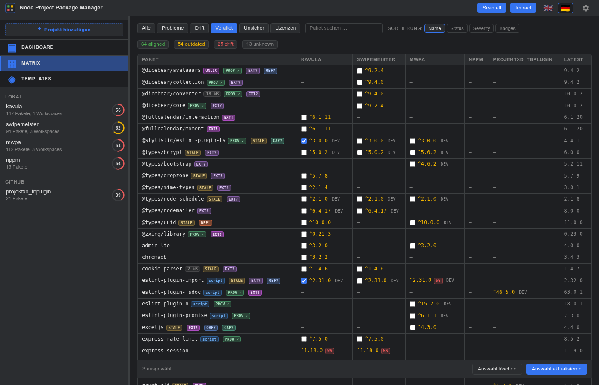

Eine sticky **Footer-Bar** erscheint unter der Tabelle, sobald die
erste Checkbox tickt: Live-Counter, **Auswahl löschen** und der
primäre **Auswahl aktualisieren**-Trigger. Auswahlen überleben
Filter-/Sort-Wechsel innerhalb derselben Page-Session und werden
beim nächsten Reload zurückgesetzt.

Klick auf **Auswahl aktualisieren** öffnet den Wizard:

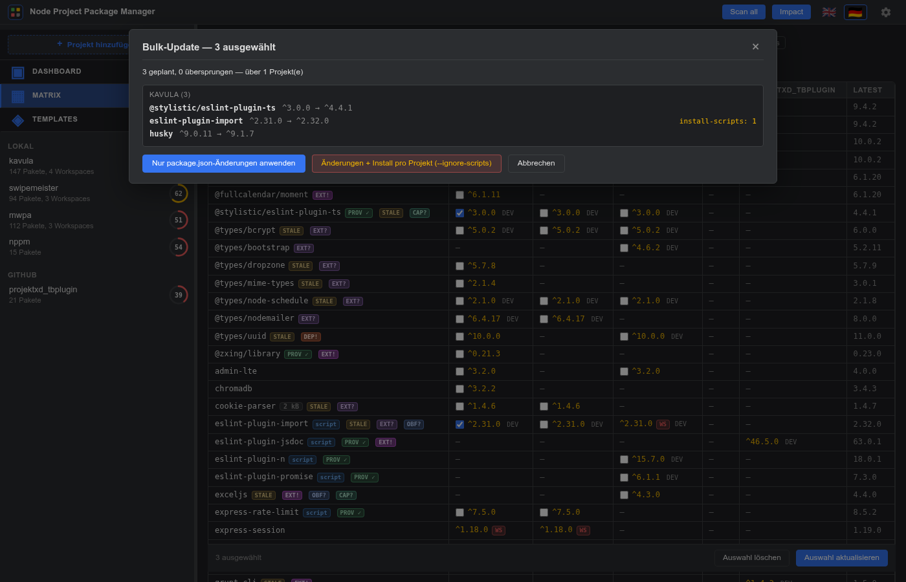

1. **Header** — Anzahl der Picks über alle ausgewählten Cells.
2. **Summary** — `N geplant, M übersprungen — über K Projekt(e)`.
   Skip-Buckets sind identisch zur Single-Pick-API: `not-local`,
   `unknown-project`, `not-found` (die Dep wird in der globalen
   Matrix über Workspaces aggregiert; lebt sie nur in einem
   Nicht-Root-Workspace, kann ein Root-Level-Edit sie nicht
   erreichen), `no-change`.
3. **Per-Projekt-Gruppen** — jedes Projekt bekommt eine eigene
   Karte mit den getickten Picks. Pro Zeile: `name`, die geplante
   `from → to`-Range und ein Einzeiler mit den schlimmsten
   Security-Signalen auf die Zielversion (CVE-Anzahl,
   Install-Scripts, Maintainer / Churn / Lizenz).
4. **Skipped-Liste** unten — jede Auswahl, die nicht geplant
   werden konnte, mit Grund. Nichts verschwindet still.
5. **Aktionen**:
   - **Nur package.json-Änderungen anwenden** — schreibt jede
     geänderte `package.json`, ein geteiltes Backup-Verzeichnis
     pro Projekt unter `.nppm-backups/<timestamp>/`, dann der
     Hinweis pro Projekt `npm install` von Hand zu starten.
   - **Änderungen + Install pro Projekt (--ignore-scripts)** —
     dasselbe plus sequenzielles `npm install`. Ein Install pro
     Projekt, niemals parallel (der npm-Cache-Lock würde
     kollidieren). Streamt das Output aller Installs live in ein
     gemeinsames Log.

Das Live-Log ist nach Projekt gruppiert:

```
── kavula (3 picks) ──
  ✓ Backup gespeichert nach .nppm-backups/2026-05-29T11-15-02Z
    · package.json
    · package-lock.json
  ✓ vitest → package.json
  ✓ vite → package.json
  ✓ typescript → package.json

  $ npm install --ignore-scripts --no-audit --no-fund
    (cwd: /home/swe/Dokumente/Projekte/pkg/kavula)

  …
  Install fertig (Exit 0)

── swipemeister (2 picks) ──
  ...
```

Ein fehlgeschlagener Install in einem Projekt erscheint als `error`,
bricht aber den Lauf für die anderen Projekte nicht ab —
Teilerfolg ist über die Backup-Ordner wiederherstellbar.

Der Wizard bietet **keinen** "Lifecycle-Scripts ausführen"-Schritt
(das Single-Package-Modal schon). Wenn nach einem Bulk-Upgrade
Scripts nachgefeuert werden müssen, das betroffene Paket in der
Per-Projekt-Matrix einzeln öffnen und den dortigen per-Script
Ausführen-Button nutzen.

> 💡 **Tipp:** Den `Outdated`-Filter mit der Suchbox kombinieren,
> um nur ein Ökosystem auf einmal zu bumpen — z.B. `vite`
> eintippen, um `vite`, `vitest`, `@vitejs/*` über alle Projekte
> auf einen Schlag zu erwischen.

---

## 9. Vulnerability-Timeline

> "Von wann bis wann war ich welcher CVE ausgesetzt?"

Der **Vulns**-Tab in der Projekt-Ansicht beantwortet genau diese
Frage mit Daten, die nppm sowieso schon hat: pro-Projekt-History-
Snapshots, OSV-Cache-Records und (für neue Funde) das OSV
`published`-Datum.


Die Ansicht sortiert jedes (CVE, `name@version`, Intervall)-Tripel
in Expositions-Karten, längste Exposition zuerst. Pro Zeile:

- **`name@version`** — die Paketversion, die während des
  Expositions-Fensters im Projekt lag.
- **Klassifikations-Badge:**
  - 🔴 `bei-Installation-bekannt` — die CVE war auf OSV bereits
    veröffentlicht, als diese Version ins Projekt kam. Du hast eine
    bekannt-verwundbare Version installiert.
  - 🟡 `während-Nutzung-bekannt` — die CVE wurde *während* der
    Nutzung veröffentlicht. Rückwirkende Exposition.
  - ⚪ `vor-Tracking` — die Version war schon da, bevor nppm
    History für das Projekt hatte; die untere Zeitgrenze ist der
    früheste bekannte Zeitpunkt, kein echtes Install-Datum.
- **`von → bis`** — Anfang / Ende des Expositions-Fensters. `läuft
  noch`, wenn die Version aktuell noch installiert ist.
- **Veröffentlichungsdatum** — wann OSV die Schwachstelle
  registriert hat.
- **Farbiger Balken** — visuelle Timeline gegen den
  History-Zeitraum des Projekts.

Der Header zeigt Coverage (`scanned / total Versionen`) und den
git-Backfill-Watermark (die HEAD-SHA des letzten Walks). Bei
frischen Projekten (noch kein Backfill) oder Cache-Lücken feuert die
Ansicht automatisch einen **Scan**-SSE: erst die git-Backfill-Phase,
dann der OSV-Catch-up. Weitere Aufrufe sind instant aus dem Cache.

Klick auf eine Zeile springt ins
[Paket-Detail-Panel](#3-paket-detail-panel) direkt auf den
Sicherheits-Tab — die Brücke zwischen Timeline und Per-Paket-Deep-
Dive.

Klick auf eine GHSA-ID im Karten-Header öffnet die offizielle
OSV.dev-Seite für den vollen Kontext.

Das ist das Compliance-grade Signal: ein 12-Monats-Expositions-
Report pro Projekt, den kein anderes npm-Tool ausgibt — weil
kein anderes npm-Tool History auf Disk pinnt.

---

## 10. PR-Review

> "Was ändert dieser Branch konkret in der Lockfile, und ist die
> CVE-Bilanz besser oder schlechter?"

Der **PR**-Tab diffft `package.json` + `package-lock.json` zwischen
zwei git-Refs (default `main` vs. `HEAD`) und rendert eine Karte
pro geänderter Dep mit dem CVE-Delta.


Der Header hat zwei Eingabefelder — **Base** und **Head** — plus
einen **Aktualisieren**-Button. Jeder lokal auflösbare Ref geht
(Branch, Tag, SHA, `HEAD~3`, …). Leer = Default.

Summary-Pillen oben:

- `hinzugefügt: N`, `aktualisiert: N`, `entfernt: N`, `Bucket: N` —
  Anzahl pro Change-Kind.
- `+N CVE` (rot) — neue Expositionen, die der Head-Branch
  *einführt*.
- `−N CVE` (grün) — Expositionen, die der Head-Branch *schließt*.

Pro Karte:

- **Change-Kind-Badge** — `HINZUGEFÜGT` (grün), `AKTUALISIERT`
  (gelb), `ENTFERNT` (rot), `BUCKET` (grau, z.B. `dependencies` →
  `devDependencies`).
- **Deklarierte Transition** — `^1.0.0 (dependency) → ^2.0.0
  (dependency)` aus der `package.json`.
- **Aufgelöste Transition** — `1.0.5 → 2.0.3` aus der
  `package-lock.json`, wenn beide Seiten eine committed Lockfile
  haben.
- **CVE-Delta-Reihen** —
  - 🔴 `Neue Expositionen (N)` — GHSA-Pillen für Vulns, die die
    Head-Version hinzufügt und die Base-Version nicht hatte.
  - 🟢 `Durch diesen PR geschlossen (N)` — GHSA-Pillen für Vulns,
    die die Base-Version hatte und die Head-Version nicht mehr.

Klick auf den Karten-Header springt ins
[Paket-Detail-Panel](#3-paket-detail-panel) auf den Sicherheits-Tab
mit der neuen aufgelösten Version. Klick auf eine GHSA-Pille
öffnet direkt die OSV.dev-Seite.

**Scope-Hinweis:** V1 zeigt nur das CVE-Delta. Maintainer-Wechsel /
Install-Skript / Pattern-Delta würden jeweils einen Tarball-Fetch
pro Seite brauchen — auf einen späteren SSE-Endpoint verschoben.
Nur lokale Projekte — beim Öffnen des PR-Tabs auf einem GitHub-/
Gitea-Projekt erscheint statt des rohen 400 ein freundlicher
Einzeiler, der auf die Lösung verweist ("Repo lokal klonen und
als lokales Projekt konfigurieren"). Echtes Remote-PR-Review
bräuchte die gleiche `git show`-API wie der Backfill-Walker.

---

## 11. Sprache wechseln

Die Flaggen oben rechts schalten die UI-Sprache. Default ist Englisch,
Deutsch ist mitgeliefert. Eine dritte Sprache hinzufügen ist ein
Drei-Schritt-Edit — siehe [`CLAUDE.md`](../CLAUDE.md) für die
Anleitung.

Die Sprachwahl wird in `localStorage` (`nppm.lang`) gemerkt und beim
nächsten Page-Load wirksam.

---

## 12. Templates (Standards-Enforcement)

Ein Template ist eine JSON-Datei, die beschreibt, wie ein Projekt
*aussehen sollte* — welche Pakete in welcher Version, welche Root-
Metadaten (`engines`, `scripts`, `type`, `packageManager`), und welche
Dateien (`.editorconfig`, `tsconfig.base.json`, …) mitgeliefert werden.
Jedes Projekt kann gegen eines oder mehrere Templates geprüft und
als Compliance-Diff dargestellt werden.

Die **Templates**-Sentinel-Zeile in der linken Treeview führt auf die
projektübergreifende Compliance-Matrix — Zeilen = Templates, Spalten =
Projekte, Zellfarbe kollabiert die per-Projekt-Findings auf eine
einzelne Stufe (`risk` / `warn` / `info` / clean).

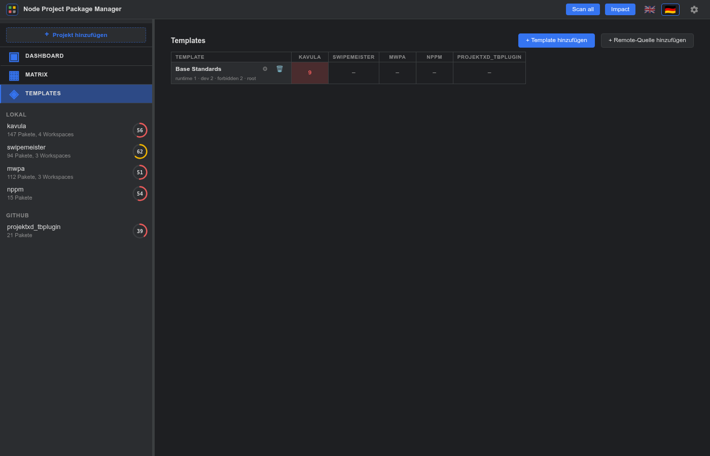

Zwei Action-Buttons in der Titelleiste:

- **+ Template hinzufügen** — öffnet das Form-Modal (Tabs Allgemein /
  Pakete / Verboten / Root / Dateien) und schreibt das Ergebnis nach
  `nppm-templates/<id>/template.json` auf die Platte.
- **+ Remote-Quelle hinzufügen** — URL zu einer rohen `template.json`-
  Datei einfügen. Sie wird an das Top-Level-Feld
  `templateSources: string[]` in `nppm.json` angehängt, nach
  `.nppm-cache/templates-remote/<id>/` gefetched und erscheint mit einem
  grünen `REMOTE`-Badge. Bearbeiten und Löschen sind bei Remote-
  Templates deaktiviert (die Quelle ist read-only); zum Ändern muss die
  Upstream-Datei editiert und ein Refresh ausgelöst werden.

Klick auf eine Zelle führt in den **Template**-Tab des Projekts in der
rechten Spalte:

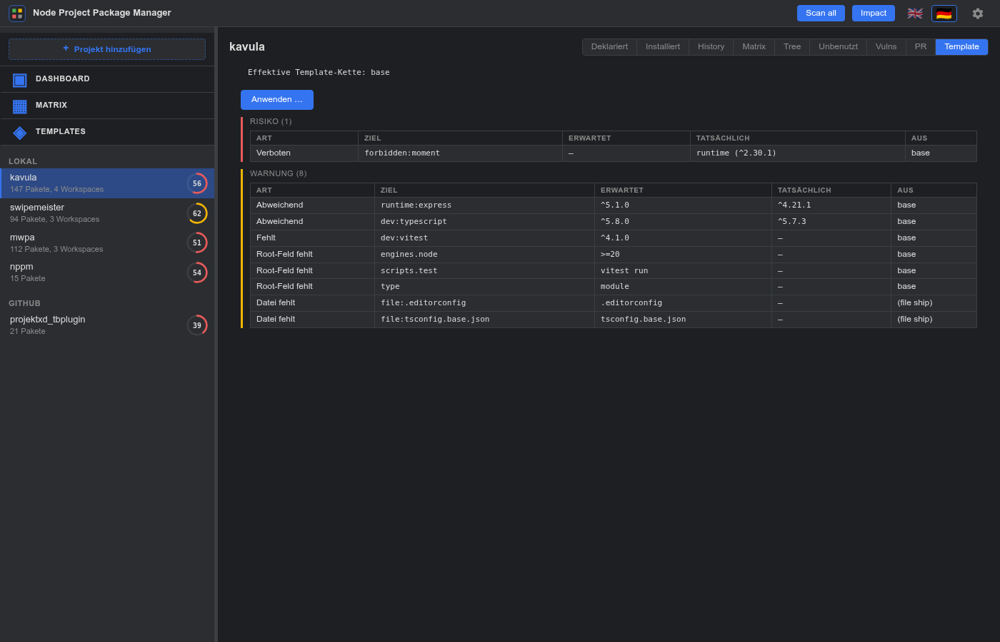

Der Diff ist nach Severity gruppiert. Jedes Finding ist eines von:
Paket fehlt / abweichend / verboten / extra (strict mode) / falscher
Bucket; Root-Feld fehlt / abweichend; Datei fehlt / Datei-Drift;
Workspace fehlt.

Der **Auswahl anwenden**-Button öffnet einen Pick-Checkbox-Modal —
risk + warn Findings sind vorgewählt, info Einträge sind opt-in. Der
Applier schreibt einen Zeitstempel-Snapshot aller berührten Dateien
nach `.nppm-backups/<timestamp>/` *vor* der ersten Änderung.
`merge-json`-Mode mergt JSON-Dateien tief (existierende Keys gewinnen
bei Konflikt); `create`-Mode legt Dateien nur an, wenn sie fehlen, und
überschreibt nie; `report-only`-Dateien werden nie geschrieben.

Die Projekt ↔ Template Zuordnung lebt im Projekt-Form-Modal — der
"Projekt bearbeiten"-Dialog hat eine Templates-Sektion mit einer
Checkbox pro verfügbarem Template, vorausgewählt für die IDs, die das
Projekt bereits trägt. Mehrere Templates werden in Reihenfolge gemerged
(spätere überschreiben).

---

## 13. Einstellungen + Cache neu aufbauen

Das Zahnrad-Icon in der Topbar öffnet einen tabbed Editor über die
Nicht-`projects`-Sektionen von `nppm.json`:

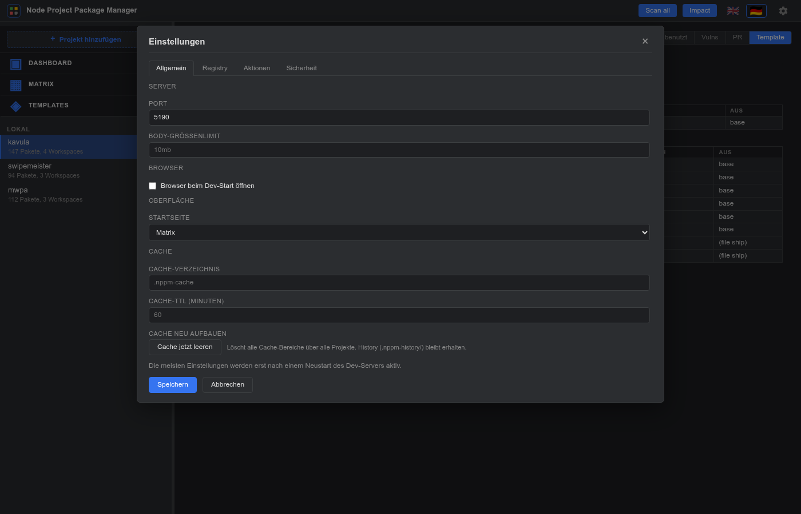

Tabs: **Allgemein** (Server-Port, Body-Limit, Browser open-on-start,
Cache-Verzeichnis, Cache-TTL), **Registry** (URL + Bearer-Token, mit
`$ENV_VAR`-Expansion), **Aktionen** (Allow-Install-Gate + Open-in-IDE
Editor), **Sicherheit** (Maintainer-Schwellen, Lizenz-Allow- /
Deny-Listen, Unused-Deps-Tuning).

Die meisten Felder werden erst nach einem Dev-Server-Neustart wirksam —
ein Hinweis über der Action-Zeile weist darauf hin. `actions.editor`
und `actions.allowInstall` werden pro Request frisch gelesen und
greifen sofort.

In der Cache-Sektion des Allgemein-Tabs sitzt ein **Cache jetzt
leeren**-Button, der alle Pockets auf der Platte wegputzt (registry /
fingerprint / releases / OSV / bundlephobia / npm-user /
templates-remote) und die Verzeichnis-Struktur erhält, damit die
in-Memory `JsonCache`-Instanzen weiterschreiben können. Direkt danach
wird `/api/matrix` (Registry-Pocket warmziehen) und der SSE-Stream
`/api/lockfile/analyze-all` (OSV-Pocket warmziehen) ausgeführt, damit
die nächste Interaktion einen gefüllten Cache trifft. Die Statuszeile
des Buttons reflektiert jede Phase. `.nppm-history/` liegt *nicht*
unter `cacheDir` und wird nicht angefasst.

---

## 14. Workspace-Drift-Drill-Down

Wenn die eigenen Workspaces eines Projekts dasselbe Paket mit
unterschiedlichen Ranges deklariert haben, kriegt die Zelle in der
projektübergreifenden Matrix ein `WS`-Badge. Klick öffnet einen
Drill-Down-Dialog:

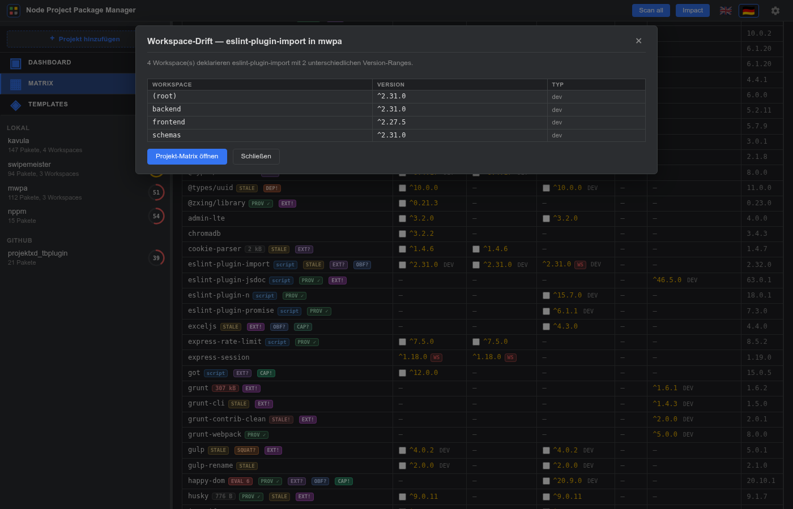

Die Tabelle listet jeden Workspace, der das Paket deklariert, mit
Version-Range und Dep-Typ. Der **Projekt-Matrix öffnen**-Button
springt im rechten Pane direkt in die Projekt-Matrix für dieses
Projekt, damit man die Spalten nebeneinander sehen und die
Disagreement auflösen kann.

---

## 15. Health-Ring pro Projekt

Jeder Projekt-Eintrag in der linken Treeview trägt einen kleinen
SVG-Progress-Ring mit einem 0–100-%-Health-Score in der Mitte. Der
Score aggregiert die Per-Paket-Severity-Zahlen der Matrix (CVE-Anzahl,
Lifecycle-Scripts, Code-Pattern, Binaries, Maintainer-Risiko,
Integrity, Freshness, Cadence, Typosquatting); der Beitrag jedes
Pakets ist auf das Risk-Tier-Gewicht gecappt, damit ein einzelnes
lautes Paket nicht alles dominiert, und dann über das Projekt
gemittelt. Die Prozent-Zahl invertiert zu einer Health-Zahl:

- **≥ 80 % — grün** — überwiegend sauber.
- **60 – 79 % — gelb** — mehrere Warn-Tier-Issues oder ein paar
  Risk-Findings.
- **< 60 % — rot** — substanzielle Findings.

Der Ring zeigt ein graues "…" als Platzhalter, bevor die
asynchronen Matrix-Scans gelandet sind — sobald jeder Badge-Loader
(CVE-Batch, Heuristik-Batch, Integrity-Check) zurückkommt, füllt
sich der Ring mit dem neuen Score nach. Sentinel-Zeilen (Matrix /
Templates) haben keinen Ring, weil sie keine Projekte sind.

---

## 16. Projektübergreifendes Dashboard

Die **Dashboard**-Sentinel-Zeile in der linken Treeview (▣-Icon,
über Matrix) ist in zwei Tabs aufgeteilt, die sich denselben
SSE-Stream teilen — Tab-Wechsel mitten im Scan startet ihn nicht
neu.

### 16.1 Scanner-Score-Tab

Eine `(Projekt × Scanner)`-Ring-Matrix: jedes konfigurierte
Projekt wird zu einer Spalte, jeder Scanner zu einer Zeile, jede
Zelle trägt einen 0–100 %-Score, der die Befunde des Scanners
über das Lockfile des Projekts aggregiert.

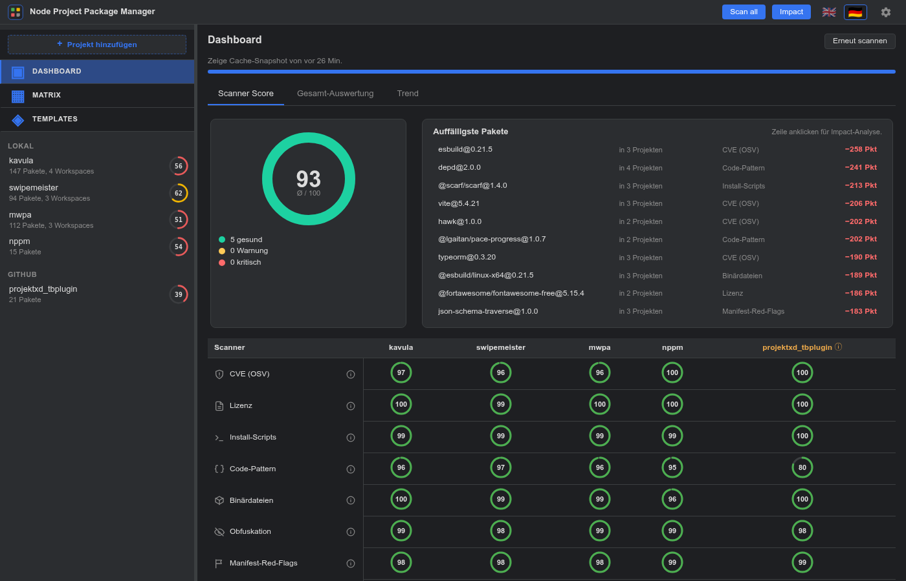

- **Score-Formel** ist identisch mit dem per-Projekt Health-Ring:
  `100 × (1 − Σ min(Gewicht, 30) / (Pakete × 30))` mit `info=1`,
  `warn=10`, `risk=30`.
- **Stufen:** ≥ 80 grün, ≥ 60 amber, < 60 rot. `N/A`-Zellen
  erscheinen, wenn der Scanner für das Projekt nicht zutrifft
  (kein Lockfile + kein Manifest-Fallback, Remote-Source beim
  Unused-Scanner, kein Template zugewiesen, keine externe Quelle
  konfiguriert). Integrity und MutableResolution bleiben auf dem
  Manifest-Fallback-Pfad immer N/A, weil beide ein Lockfile zum
  Walken brauchen.
- **Erster Paint** nutzt den persistierten Snapshot unter
  `.nppm-cache/dashboard-snapshot.json` — die Ansicht ist sofort
  da beim Öffnen. Im Header steht, wann er zuletzt aktualisiert
  wurde; **Re-Scan** streamt einen frischen Lauf via SSE.
- **Progress-Detail.** Die Status-Zeile unter dem Fortschritts-
  balken zeigt die jeweilige Unter-Phase wortwörtlich —
  "Loading lockfile for kavula", "Querying OSV.dev for 84
  package(s)", "Fingerprinting lodash@4.17.21 (32/84) —
  kavula", "Churn for axios@1.6.0 (18/84) — kavula" — damit ein
  langer Parallel-Batch nicht mehr eingefroren auf einem
  "CVE (OSV) 0/84"-Zähler aussieht.
- **Manifest-Fallback für Projekte ohne Lockfile.**
  Browser-Extensions, viele Libraries und andere Repos, die
  keine `package-lock.json` committen, kollabierten früher
  jede Zelle auf N/A und färbten den Spaltenkopf rot. Ihre
  deklarierten Deps werden jetzt zum Registry-`latest` aufgelöst
  und durch die Scanner-Pipeline geschickt; dieselben Zellen
  leuchten auf, nur fixiert auf das, was `npm install` heute
  installieren würde, statt auf das, was committed wurde. Eine
  kleine ⓘ neben dem Projektnamen trägt im Tooltip die Notiz
  "no lockfile — scanned against registry latest".
- **Persistenter SSE.** Der Wechsel in eine andere Ansicht
  (Templates, Impact, ein Projekt) tötet den laufenden Scan
  nicht mehr — bei Rückkehr ins Dashboard läuft der Stream
  weiter, statt neu bei null zu starten.
- **Zellklick** öffnet das [Findings-Modal](#3-paket-detail-panel)
  — Top-50 Beiträger sortiert risk → warn → info, mit
  Ein-Klick-Sprüngen in die relevante Per-Projekt-Ansicht
  (Installed für CVE / Integrity, Unused für Unused, Template
  für Compliance) oder direkt in das Paket-Detail-Panel für die
  Per-Paket-Scanner.
- **Header-Klick** öffnet die Per-Paket-Matrix des Projekts.
- **Scanner-Zeilen-Hover** hebt die Zeile hervor und zeigt einen
  `i`-Info-Button mit Beschreibung, was der Scanner prüft + wie
  der Score berechnet wird.

### 16.2 Overall-Evaluation-Tab

Eine einzelne 3:2-Ecosystem-Hero-Card mit der Wald-Szene als
Hintergrund und zehn transluzenten Metrik-Boxen rund um den
zentralen Baum — grün umrandet auf der gesunden Seite, rot
umrandet auf der riskanten Seite, jede mit einer dünnen
glühenden SVG-Linie zum visuellen Anker verbunden.

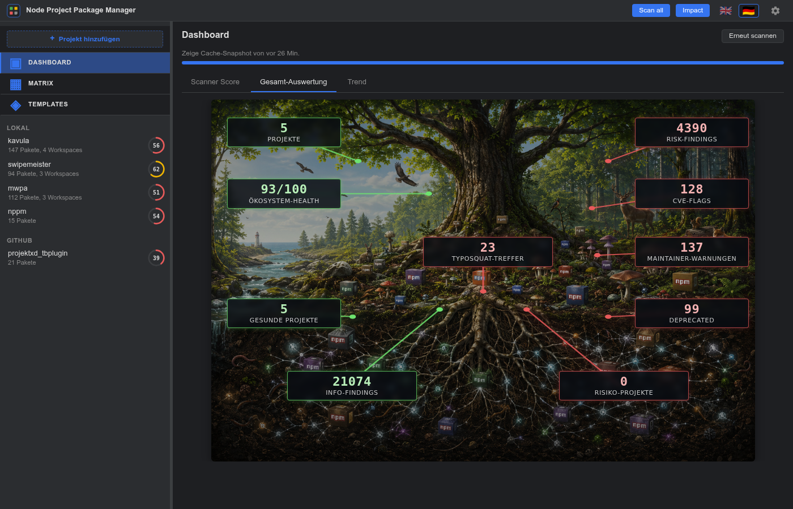

Alle Metriken stammen aus derselben `_columns`-Map wie der
Scanner-Score-Tab, deshalb füllt sich die Card live mit, während
der Scan läuft — kein zusätzlicher Fetch, kein separater Scan.

**Die zehn Boxen** (Hover für einen Einzeiler, Klick für das
Detail-Modal):

- **Projekte** — Gesamtzahl der Projekte.
- **Gesunde Projekte** — Anzahl Projekte mit Gesamt-Score ≥ 80.
- **Ecosystem-Health** — Durchschnitts-Score über alle
  Nicht-N/A-Zellen.
- **Info-Findings** — Gesamt-Info-Tier-Befundzahl.
- **Risk-Findings** — Gesamt-Risk-Tier-Befundzahl.
- **CVE-Flags** — Pakete mit mindestens einem CVE-Befund.
- **Deprecated-Flags** — Pakete vom Deprecation-Scanner
  markiert.
- **Maintainer-Alerts** — Pakete vom Maintainer-Scanner
  markiert.
- **Typosquat-Treffer** — Pakete vom Typosquat-Scanner
  markiert.
- **At-Risk-Projekte** — Anzahl Projekte mit Score < 60.

**Detail-Modals.** Klick auf eine Box öffnet
`EcosystemBoxModal`, das per Box-ID dispatchet und die passende
Aufschlüsselung rendert:

- Projekt-förmige Boxen (Projekte / Gesund / At-Risk) listen
  die betroffenen Projekte mit Score und bieten einen **In
  Matrix öffnen**-Button, der die Ansicht wechselt.
- Ecosystem-Health listet Pro-Scanner-Durchschnitte über das
  Ökosystem.
- Info / Risk Roll-ups schlüsseln Severity-Counts pro Scanner
  auf.
- CVE / Deprecated / Maintainer / Typosquat listen die
  betroffenen Pakete mit Projektzuordnung. Paket-Zeilen sind
  bewusst nicht klickbar — ein einzelnes Paket taucht oft in
  mehreren Projekten auf, und die projektübergreifende Matrix
  ist die richtige Fläche zum Drill-Down, nicht das
  per-Projekt-Panel.

Das Dashboard lässt sich als Default-Landing-View einstellen via
Einstellungen → Allgemein → "Startseite". Der per-Projekt-
Durchschnitt des Dashboards füttert auch den Health-Ring im
Treeview (mit dem Matrix-Score als Fallback für Projekte, die
das Dashboard noch nicht gescort hat), damit die Zahl im
Sidebar immer das wiedergibt, was das Dashboard sagt.

### 16.3 Trend-Tab

Pro-Scan persistiert ein kompakter Tages-Eintrag in
`.nppm-history/dashboard/YYYY-MM-DD.json` (letzter Scan des Tages
gewinnt). Der **Trend**-Tab plottet diese Historie als
Multi-Linie-Chart, eine Linie pro Projekt plus eine dickere
Ökosystem-Linie obendrauf.

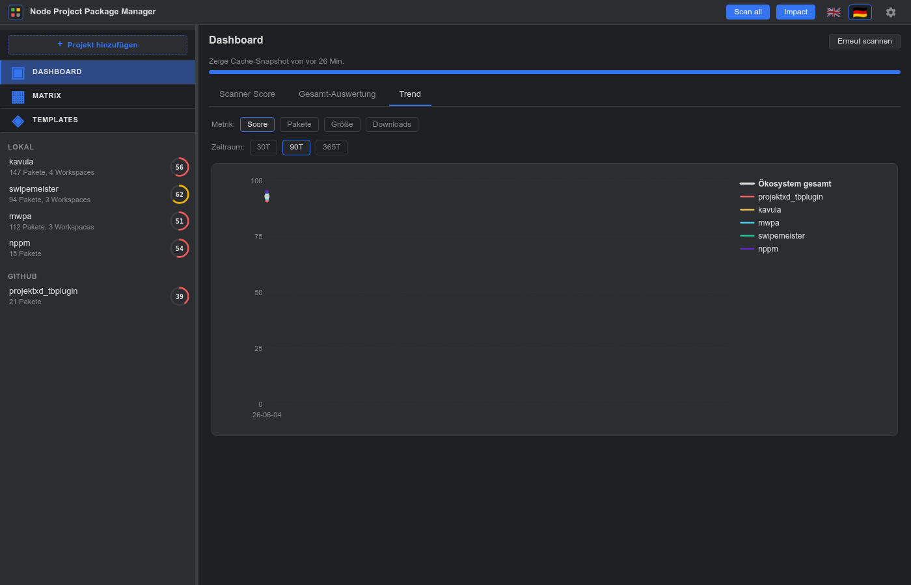

Über dem Chart sitzen zwei Chip-Reihen:

- **Metric** — `Score` / `Pakete` / `Größe` / `Downloads`. Score
  ist Default und liest aus dem Tages-Eintrag direkt; die anderen
  drei lazy-laden ihren Datentopf beim ersten Klick und cachen
  ihn für die Session.
- **Range** — `30T` / `90T` / `365T`. Wechsel triggert Re-Fetch
  mit serverseitigem Clipping (für Score) bzw. Range-Replay (für
  Pakete).

**Metric-Definitionen:**

- **Score** liest `overall` aus jedem Tages-Eintrag — derselbe
  Mittelwert, der oben rechts im Macro-Donut steht.
- **Pakete** rekonstruiert die Installations-Anzahl pro Projekt
  über die Zeit aus `HistoryStore`, indem es vom heutigen Stand
  rückwärts durch jeden Add/Remove-Event walked. Geht typischerweise
  Jahre zurück, weil `GitHistoryBackfill` auf jedem `git log
  -- package-lock.json` läuft. Ökosystem-Summe ist Carry-Forward
  über nicht-aligned Projekt-Timestamps.
- **Größe** summiert pro Projekt `dist.unpackedSize` über alle
  installierten Paket-Versionen. Best-Effort-Untergrenze: sehr alte
  Releases ohne `unpackedSize` fallen aus der Summe. Ökosystem-Summe
  hier *nicht* dedupliziert — jedes Projekt hat seine eigene
  Kopie der Pakete auf der Platte.
- **Downloads** holt für jedes distinct installierte Paket aus
  `api.npmjs.org/downloads/point/last-week/<pkg>` die Wochen-
  Downloads (24h cached). Per-Projekt-Summe dedupliziert
  innerhalb des Projekts (Paket über mehrere Pfade gezogen
  zählt einmal). Ökosystem-Summe dedupliziert *über alle
  Projekte* — `react` in drei Projekten ist trotzdem nur ein
  Download-Bucket. Die Lücke zwischen `Σ Per-Projekt` und
  `Ecosystem total (dedupliziert)` ist selbst ein Signal für
  Dep-Tree-Overlap.

Macro-Donut, Top-N Worst Packages und die Score-Delta-Zeile
("↑2 vs letzter Scan") sitzen unverändert im Scanner-Score-Tab —
nur Trend zeigt den vollen Zeitverlauf.

---

## 17. Impact-Analyse

Der **Impact**-Button in der Topbar beantwortet: *"wenn
`<name>@<version>` sich als bösartig herausstellt, welche meiner
Projekte sind betroffen — direkt oder transitiv — und über welchen
kürzesten Pfad?"*.

Das Suchfeld nimmt entweder einen reinen Namen (`lodash`) oder
eine fixierte Version (`lodash@4.17.20`) entgegen. Eine BFS läuft
durch den aufgelösten Dep-Graph jedes konfigurierten Projekts,
findet jede erreichbare Instanz und meldet:

- **Projekt-Liste** mit Anzahl der erreichbaren Instanzen.
- **Pfad pro Treffer** — kürzester Pfad von der Root-Deklaration
  zum getroffenen Node (z.B. `root → axios → form-data → lodash`).
- **Version-Pinned-Filter** — wenn `name@version` übergeben wird,
  ist das Version-Matching permissiv (Range-Erfüllung), damit
  "wer fährt diese CVE-Surface gerade?" auch dann beantwortbar
  bleibt, wenn Projekte unterschiedliche installierte Minors
  fahren.

Versteckte Projekte werden mitgescannt — Incident-Response kümmert
sich um jedes Repo, unabhängig von Dashboard-Filterung.

---

## 18. Badge-Filter

Die globale Matrix kann 16 verschiedene Badge-Familien rendern.
Wenn die Zeile zu voll wird — oder ein Ökosystem (z.B.
Lizenz-Klassifikation) alles andere übertönt — öffnet der
**Badges**-Button in der Toolbar ein Filter-Modal:

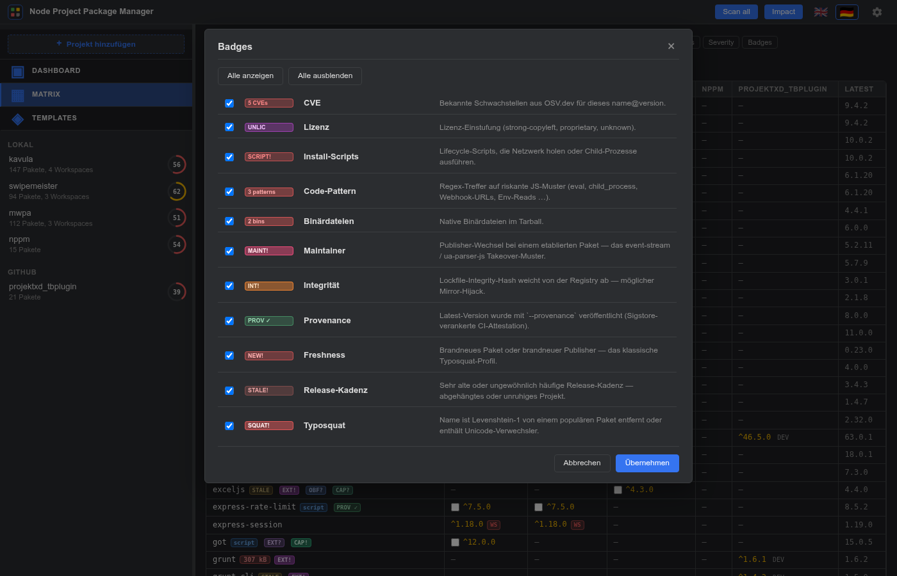

Jede Zeile zeigt:

- eine **Checkbox** (Default: an → Badge sichtbar),
- ein echtes **gestyltes Sample** des Badges — gleiche CSS-Klassen
  wie die Matrix, damit Farbe und Schriftstärke exakt
  übereinstimmen,
- das **Label**,
- eine **einzeilige Beschreibung**, was das Badge auslöst.

Zwei Shortcuts oben: **Alle anzeigen** schaltet alles ein,
**Alle ausblenden** alles aus. Die Auswahl wird mit **Übernehmen**
angewendet; der Toolbar-Button zeigt dann `Badges (N ausgeblendet)`
mit aktivem Highlight, damit eine gefilterte Matrix sofort
erkennbar ist.

Die Auswahl persistiert in `localStorage` zusammen mit den anderen
Matrix-States (Filter / Sortierung / Suche). Reload-sicher, kein
Server-Roundtrip.