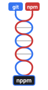
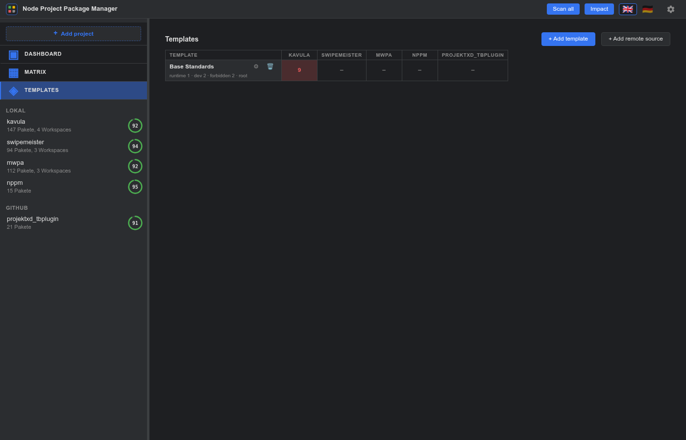
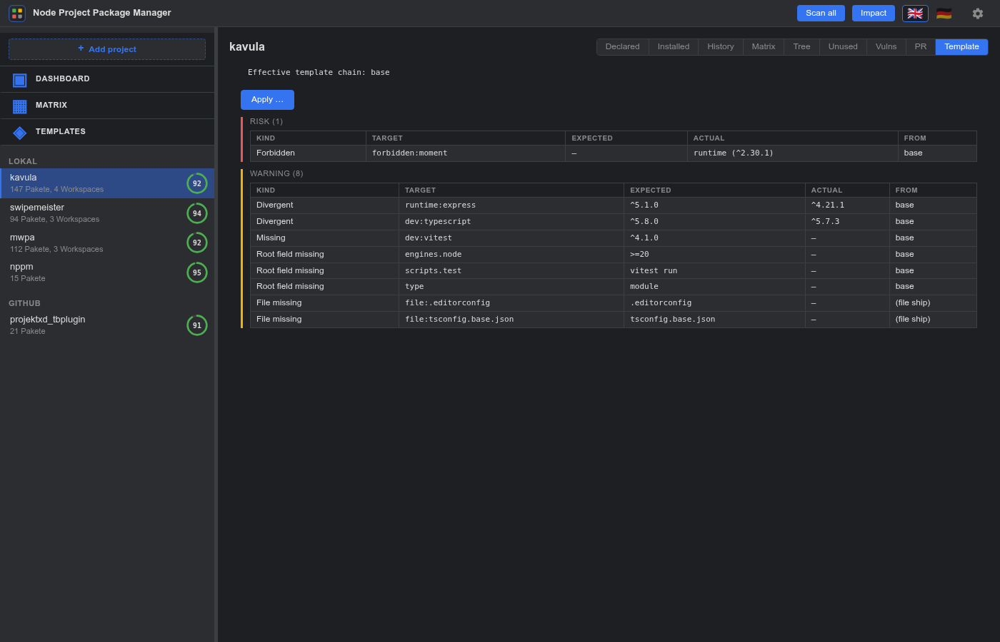
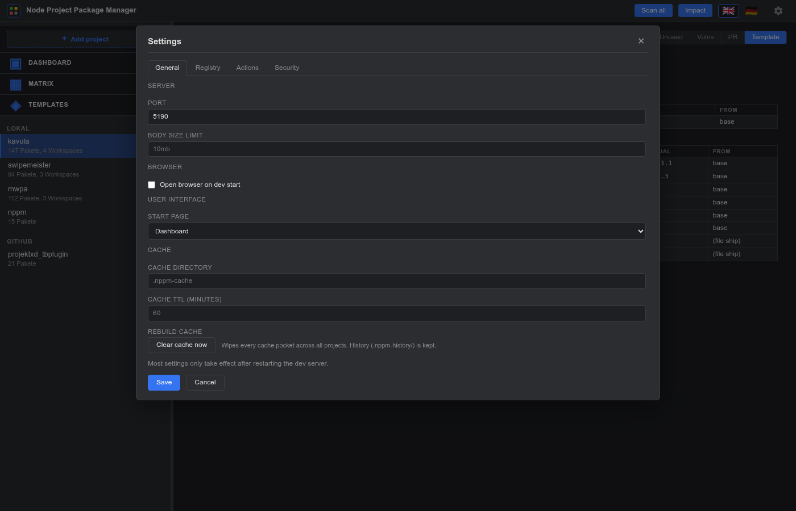
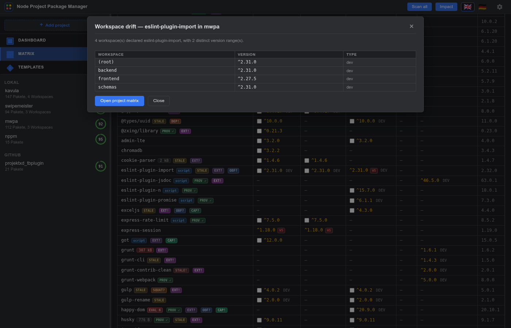
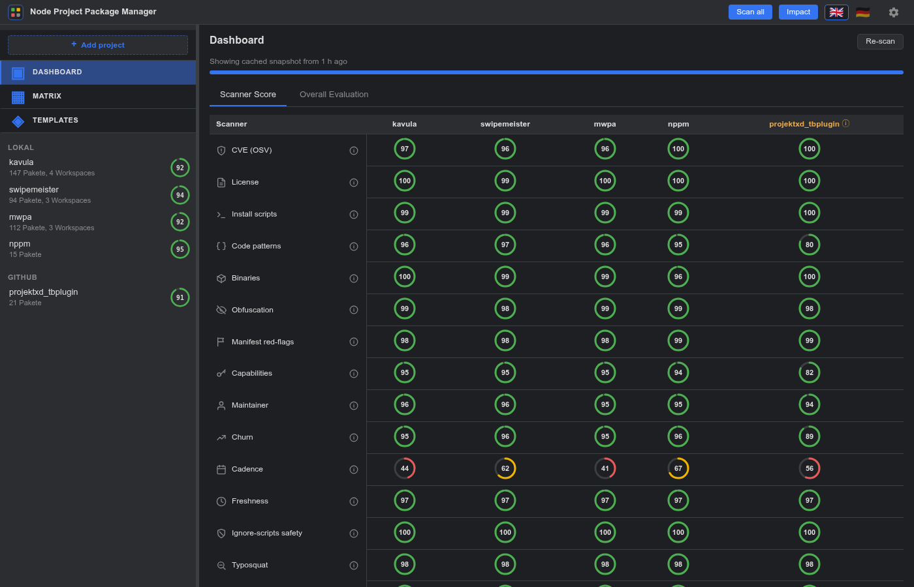

<p align="center">
  
</p>

# nppm — User Manual

> 🇩🇪 Deutsche Version: [`manual_de.md`](manual_de.md)

This walkthrough mirrors what you see in nppm after pointing it at your
own `nppm.json`. All screenshots are generated against the *current*
configured projects via `npm run docs:screenshots` — re-run that any
time the UI changes.

<p align="center">
  
</p>

> **git + npm — the best combination.** nppm draws its strength from
> both data sources at once: the **npm registry** carries versions,
> publishers, integrity, provenance and CVE links for every package;
> **git** carries the time axis — which lockfile state belonged to
> which commit. Interweaving the two is what makes the retroactive
> vulnerability timeline, the PR-review dep deltas and the
> git-backfilled history possible at all. A local nppm project is
> therefore at its best when it is both versioned in git **and**
> reproducibly installed via `package-lock.json`.

## Table of contents

1. [The cross-project matrix](#1-the-cross-project-matrix)
2. [Drilling into one project](#2-drilling-into-one-project)
   - [Declared dependencies](#21-declared-dependencies)
   - [Installed dependencies](#22-installed-dependencies)
   - [Per-project matrix](#23-per-project-matrix)
   - [Dependency tree](#24-dependency-tree)
   - [History](#25-history)
   - [Unused dependencies](#26-unused-dependencies)
3. [Package detail panel](#3-package-detail-panel)
   - [Files](#31-files)
   - [Dependencies](#32-dependencies)
   - [Releases](#33-releases)
   - [Security](#34-security)
4. [Global CVE scan](#4-global-cve-scan)
5. [Headless CI mode](#5-headless-ci-mode)
6. [SBOM export](#6-sbom-export)
7. [Upgrading a dep (Upgrade modal)](#7-upgrading-a-dep-upgrade-modal)
8. [Bulk-Update Wizard](#8-bulk-update-wizard)
9. [Vulnerability Timeline](#9-vulnerability-timeline)
10. [PR Review](#10-pr-review)
11. [Switching language](#11-switching-language)
12. [Templates (standards enforcement)](#12-templates-standards-enforcement)
13. [Settings dialog + cache rebuild](#13-settings-dialog--cache-rebuild)
14. [Workspace drift drill-down](#14-workspace-drift-drill-down)
15. [Per-project health ring](#15-per-project-health-ring)
16. [Cross-project Dashboard](#16-cross-project-dashboard)
17. [Impact analysis](#17-impact-analysis)
18. [Badge filter](#18-badge-filter)

---

## 1. The cross-project matrix

This is the landing view. Rows are **packages**, columns are
**projects** plus a trailing **Latest** column from the npm registry.
Cell colour indicates the row status:

- 🟢 **aligned** — every project that pins this package uses the same
  range *and* the range resolves to the registry latest.
- 🟡 **outdated** — every project agrees, but the registry has a newer
  version.
- 🔴 **drift** — at least two projects disagree on the version.
- ⚪ **unknown** — registry lookup failed.


**Filters** at the top-left: `All / Issues / Drift / Outdated / Unsafe /
Licenses` (the last one shows only packages with strong-copyleft,
proprietary, or unknown licenses).
The **search box** does case-insensitive substring matching on the
package name. **Sort:** by name, by status (most urgent first), or by
aggregated security score.

**Badges in the name cell:**

- `CVE N` — N known OSV.dev vulnerabilities for the latest version.
- `SCRIPT` / `SCRIPT!` — lifecycle scripts at warn / risk level.
- `EVAL N` — N dynamic-code-execution patterns in the tarball.
- `BIN N` — N native binaries (`.exe / .dll / .so` …) in the tarball.
- `OWNER!` — quick owner handover on a mature package (classic
  account-takeover profile — see the maintainer scanner below).
- `GPL` / `UNLIC` / `LIC?` — license classification: strong-copyleft /
  proprietary / unknown (see the License tab below).
- `PROV ✓` — green positive badge: the latest version was published
  with `--provenance` (Sigstore-anchored CI attestation).
- `NEW!` / `NEW` — brand-new package or publisher (< 7 days / < 30
  days). Classic typosquat profile when both signals fire.
- `STALE!` / `STALE` — package looks abandoned (≥ 730 days / ≥ 180
  days since the last release).
- `SQUAT!` / `SQUAT?` — name is Levenshtein-1 from a popular
  package OR contains Unicode confusables / Levenshtein-2 lookalike.
- `EXT!` / `EXT?` — external-source aggregator (socket.dev /
  OpenSSF Scorecard / deps.dev) flagged this package — worst-of-three
  severity.
- `DEP!` / `DEP?` — installed version was deprecated by the
  maintainer (risk) or the registry `latest` is deprecated (warn).
  Hover for the maintainer's reason.
- `OBF!` / `OBF?` — JS file inside the tarball looks intentionally
  obfuscated (`eval(atob(…))` / `_0x` density / hex-string arrays /
  long lines outside `dist/min/`).
- `MAN!` / `MAN?` — manifest red-flags stacked: missing README /
  description / files[], many bin entries, the native-build +
  postinstall combo, dated `engines.node`.
- `CAP!` / `CAP?` — dangerous capability combinations
  (`child_process` + network / env + network / native + network).
  Single capability stays silent.
- `INT!` — lockfile integrity hash mismatches the registry
  (possible mirror hijack).
- `WS` — workspaces within one project disagreed. Click it to open a
  [workspace drift drill-down](#14-workspace-drift-drill-down).

Click any badge to open the [package detail panel](#3-package-detail-panel)
on the Security tab.

The **Badges** toolbar button opens a modal that lets you hide
individual badge families when the row is too busy — see
[§18 Badge filter](#18-badge-filter).

**Git-pinned dependencies** show the *installed* version as the cell
value plus a small `git` chip; hovering reveals the original URL. The
**Latest** column for rows where *every* declaration is a git URL
shows the upstream HEAD as `1.0.28 · 7d3f12a` — `package.json.version`
from the HEAD tarball plus the short commit SHA — for GitHub and
Gitea hosts. The npm-published package of the same name is treated
as unrelated, so cadence / freshness / maintainer / CVE / bundle /
license / provenance / typosquat scans are skipped to avoid
mis-attribution. When the host can't be reached, the cell falls back
to a plain `git` pill with an orange ⓘ next to it — hover for the
raw error ("GitHub unreachable: …" / "Repository not found on
GitHub"). Unsupported hosts stay silent (no icon).

Clicking a cell opens the [package detail panel](#3-package-detail-panel).
Clicking a project column header drills into that project.

---

## 2. Drilling into one project

Picking a project in the left treeview lands you in an eight-tab project
view: **Declared / Installed / History / Matrix / Tree / Unused / Vulns
/ PR**. The toggle is the same in every tab so navigation is one click
away regardless of where you are.

### 2.1 Declared dependencies

Flat table of every dependency declared in the project's `package.json`
(root + workspaces).


### 2.2 Installed dependencies

What npm actually resolved on disk. The view shows the *source* used:

- **`package-lock.json v3`** — committed lockfile (best fidelity).
- **`node_modules/.package-lock.json v3`** — npm's hidden mirror,
  exactly the same data, written on every `npm install` — used when the
  committed lockfile is gitignored.
- **Generated from `node_modules`** — last-resort flat walk when no
  lockfile exists (no `dev` / `peer` / `optional` flags).


The **Start analysis** button kicks off a per-project SSE-streamed OSV
check; the CVE column fills row-by-row while the progress bar runs.

The **Integrity column** is filled at load time — no button required.
Each row gets one of:

- `✓` — lockfile `integrity + resolved` match what the npm registry
  currently serves (the common case).
- `mismatch` (red) — the registry now serves a different SRI hash than
  the lockfile pinned. Possible mirror-hijack, dependency-confusion,
  or hand-edited lockfile. Hover the pill for the side-by-side hashes.
- `mirror` (grey) — `resolved` URL points off-registry but the
  integrity still matches. Harmless custom mirror.
- `no-hash` (grey) — lockfile entry has no integrity field (old npm,
  hand-edits, git deps).
- `private` (grey) — registry doesn't know this package. Private /
  unpublished / internal.
- `—` (muted) — registry cache hasn't been populated yet; show the
  Declared view once or run a scan to warm it up.

A summary pill (`Integrity: 1 mismatch · 3 info`) appears next to the
meta line when the scan found anything non-trivial; clean projects
stay quiet. The whole check is network-free against the registry
cache that the Declared view + global scan populate.

Each row's path cell gets a small **`IDE`** button when
`actions.editor` is set in `nppm.json`. Clicking it opens
`node_modules/<pkg>` in the configured editor via its URL handler
(`vscode://`, `vscodium://`, `cursor://`, `phpstorm://`, `webstorm://`,
`idea://`, `subl://`). Hidden for remote projects (the files aren't on
your disk) and when no editor is configured.

### 2.3 Per-project matrix

Same shape as the global matrix, but columns are the project's
*workspaces* instead of other projects. Use it when one project's own
workspaces drift.


The same git-only Latest guard from the cross-project matrix runs
here too: rows where every workspace declared the dep via a git URL
get `latest=null` plus the upstream HEAD stamp
(`1.0.28 · 7d3f12a` from GitHub / Gitea), and the ⓘ icon next to
the pill carries any HEAD-fetch error. For remote (GitHub / Gitea)
projects the upgrade `↑` button is hidden and a small "Read-only:
remote project — upgrades and template apply are disabled." banner
sits at the top of the view so the missing button doesn't look
like a bug.

### 2.4 Dependency tree

D3 collapsible tree. Root = the project, children = top-level deps,
expanding any node loads its sub-dependencies on demand. Node colour
matches the status semantics; an outlined node has hidden children left
to expand.


**Manifest fallback.** Projects without a committed
`package-lock.json` (common for browser extensions and many
libraries) get a shallow tree synthesised from the declared root
deps in `package.json` instead of a 404: each top-level entry
carries its declared range as the version string and the
registry's `latest`, with no children. A one-line banner above
the tree calls out the fallback so the empty `deps[]` doesn't get
mistaken for "this project has no transitive deps". Commit a
lockfile to get the full transitive graph.

### 2.5 History

Every time nppm loads this project's lockfile, it diffs against the
prior snapshot and appends an entry when anything changed. The reason
field is auto-generated from the semver bump type, with a CVE hint when
the outgoing version had known vulnerabilities in the OSV cache.


Entries are rendered as a vertical timeline. Each date gets its own
pill at the top of its group; each entry has a coloured icon on the
track — `+` (green) for add-only changes, `~` (yellow) for pure
updates, `−` (red) for remove-only, `●` (accent) for anything mixed.
History files live in `.nppm-history/` next to your `nppm.json` —
safe to commit if you want long-term audit trails.

**Git backfill.** The scan bar above the timeline carries a
`Backfill from git` button (disabled when no `.git/` source is
detected for this project). One click walks `git log --
package-lock.json` on local projects (or the equivalent commits API
for GitHub / Gitea sources) and reconstructs the full dep history
retroactively — one entry per commit that touched the lockfile, with
the real commit SHA + author timestamp. When no lockfile was ever
committed, the walker falls back to `git log -- package.json` and
tracks declared-range drift instead; those entries get a yellow
`declared-only` pill in the History view because the version strings
are ranges (`^4.0.0`) rather than concrete versions, and the Vulns
view can't OSV-query them.

The pill next to the button shows whether a backfill has run yet
(`git history reconstructed from <sha>`) or is still pending
(`git history not yet reconstructed — run a scan`). Re-running is
cheap: idempotent by HEAD SHA, only new commits get processed. The
backfill is also triggered transparently the first time the Vulns
view opens — but if you only want the history view filled in (no OSV
catch-up), the History button is the faster path.

### 2.6 Unused dependencies

A depcheck-style hygiene scan of the project's source tree. The tab
groups findings into three lists:

- **Unused** — declared in `package.json` but nothing under `src/`
  imports them. Severity is `risk` for genuine candidates and `info`
  for entries the scanner deliberately spared (allowlist / `scripts:`
  reference / `@types/X` whose `X` is imported).
- **Misplaced** — imported only from dev paths (`*.test.*`,
  `*.spec.*`, `tests/`, `*.config.*`) but listed in `dependencies`
  instead of `devDependencies`. Fix is a `package.json` edit.
- **Missing** — imported from source but not declared anywhere.
  Usually a transitive leak, sometimes a forgotten peer dep.

The scanner is regex-based (no AST parse). Dynamic specs like
`import(varName)` cannot be resolved; affected files are listed
separately so the unused list isn't mistaken for authoritative there.

A default allowlist covers the bin-tools that nearly every npm
project keeps in `devDependencies` (`vite`, `vitest`, `tsx`,
`typescript`, `eslint`, `prettier`, `husky`, `rimraf`, `cross-env`, …)
plus the well-known `tsc → typescript` bin alias. Add your project's
extras via `security.unused.allowlist` in `nppm.json` — the default
list is *unioned*, not replaced, so a one-line override doesn't
re-introduce a wall of false positives.

Remote projects (GitHub / Gitea) currently show "not supported here"
because the contents-API per-file fetch would blow the rate-limit
budget in v1.

---

## 3. Package detail panel

Clicking a matrix cell opens a modal with five tabs.

### 3.1 Files

Per-file SHA-256 + size of every file in the tarball. The header shows
total file count and total bytes.


### 3.2 Dependencies

What the package itself declares as `dependencies`, `devDependencies`,
`peerDependencies`, `optionalDependencies`. Pulled directly from the
tarball's `package.json` (cached permanently).


### 3.3 Diff

Compares the cell version against the registry latest, file-by-file:
added / removed / modified. Lazy-loaded the first time the tab opens.

For **git-installed deps** pinned to a `#ref` (`git+https://…#v1.2.3`,
`github:owner/repo#abc1234`), the tab compares the pinned tarball
against the upstream HEAD. Non-SHA-pinned coordinates (branches /
tags) skip the permanent fingerprint cache so HEAD content is never
served stale. Unpinned git URLs still disable the tab — there's no
second coordinate to diff against.

### 3.4 Releases

Merged timeline. Registry-published packages show:

- Registry publish dates (always available)
- Per-version publisher (`_npmUser`) — shown as `by <name>` next to the
  date so owner handovers are visible at a glance in the timeline.
- GitHub release titles + notes (when the package's `repository` field
  points at github.com)

**Git-installed deps** route through the host's commits API
(GitHub REST, Gitea v1 with the per-instance token) and render
each commit in the same release-card shape: SHA, subject and
author. Up to 50 entries, sorted newest first.

Both modes start collapsed at five cards with an "Alle laden (N)"
button at the bottom — `lodash` is 60+ versions, and forcing the
user to scroll past all of them every time defeats the point.
Reopening a different package starts collapsed again.

The number on the right is a direct link to the GitHub release page.
Set `GH_TOKEN` in your `.env` to lift the 60 req/h anonymous rate
limit.


### 3.5 Security

Aggregates the full scanner family as collapsible cards (license has
its own tab — see 3.6). The non-noisy default is "every card
collapsed unless its findings carry warn/risk", so a healthy package
shows a banner + a stack of folded cards; a problematic one expands
the relevant ones for you.

- **CVEs** from OSV.dev (single-version query, deep results)
- **Install-scripts** — lifecycle hooks classified info/warn/risk
- **Code patterns** — `eval(`, `new Function(`, `child_process`, base64,
  webhook URLs, credential-shaped env reads, `_0x` obfuscator
  fingerprint
- **Binaries** — native code in the tarball
- **File churn** — comparison against the previous stable version
- **Maintainer / Publisher** — compares the `_npmUser` of the chosen
  version against the trust set of recent predecessors.
- **Provenance / signing** — Sigstore attestation + npm key
  signatures. Three levels: `provenance` (Sigstore-attested),
  `signed` (registry baseline), `unsigned` (very old or non-npm
  mirror).
- **Freshness** — package age (`time.created`) + publisher account
  age. The worst-of-two is rendered as `risk` (< 7 d) / `warn`
  (< 30 d) / `info`.
- **Release cadence** — days since last release + median gap over
  the last 10 versions. Surfaces abandoned (`risk`) and slowing
  (`warn`) projects.
- **Typosquat / homoglyph** — distance + Unicode confusables versus
  a curated popular-package list.
- **Deprecation** — reads per-version `deprecated` from the
  packument. Shows the maintainer's reason string verbatim
  ("use foo@2 instead", etc.).
- **Obfuscation** — per-JS-file finding list: `path`, signals
  (`eval-decoded` / `obfuscator-io-identifier` / `hex-string-array`
  / `long-line` / `dense-hex-literals`) and a short detail (max
  line length, `_0x` density, …). Build artifacts (`dist/`,
  `*.min.js`, …) are recognised and capped at info so legitimate
  minification doesn't pollute the result.
- **Manifest red-flags** — `package.json` heuristics: missing
  README / description / files allowlist, many `bin` entries, the
  native-build + postinstall combo, dated `engines.node`. Severity
  stacks: 1 flag = info, 2 = warn, 3 or the malicious combo = risk.
- **Capability inventory** — which platform APIs the JS files
  touched. Risk is by *combination* (spawn + network, env-read +
  network, native + network); single capability stays info.
- **External sources** — three subsections (socket.dev / OpenSSF
  Scorecard / deps.dev) each with score, deep-link, and the
  source-specific reason. Disabled-by-default for socket (needs an
  API key); OpenSSF + deps.dev work free without auth.

The maintainer scanner's severity is driven by **how quickly the owner
changed** on a mature package — the empirical attack pattern (event-
stream, ua-parser-js, coa, rc, @solana/web3.js) is "active project,
sudden new publisher", not "dormant project, new maintainer".

| Gap to previous version | Severity |
|-------------------------|----------|
| ≤ 30 days + ≥10 predecessors | `risk` — takeover profile |
| 31 – 180 days + ≥10 predecessors | `warn` — unusual, worth a look |
| > 180 days | `info` — likely a legitimate community takeover of an abandoned package |

Thresholds are tunable in `nppm.json` under
`security.maintainer.{quickHandoverDays,suspiciousGapDays,matureVersions,trustWindow}`.

When `Maintainer = risk` **and** `Churn = warn/risk` hit the same
release, the panel shows a red **"possible supply-chain attack"**
banner at the top — that is the pattern the real-world takeovers
listed above all shared.

A "git package" note appears for git-installed dependencies because OSV
only indexes registry versions — the other scanners still run normally.


### 3.6 License

A dedicated tab for compliance questions. Classifies the package's
`license` field into five buckets:

| Bucket | Examples | Meaning |
|--------|----------|---------|
| `permissive` | MIT, Apache-2.0, BSD-*, ISC | No obligations |
| `weak-copyleft` | LGPL-*, MPL-2.0, EPL-2.0 | File-level boundary, mostly accepted |
| `strong-copyleft` | GPL-*, AGPL-* | Viral, derivatives must release source |
| `proprietary` | `UNLICENSED`, `SEE LICENSE IN …` | No redistribution without contract |
| `unknown` | not in the SPDX catalogue | Not classifiable — manual review |

A mini SPDX-expression parser handles compound forms like
`(MIT OR Apache-2.0)` (for OR the most permissive bucket wins — the
user gets to pick) and `MIT AND GPL-3.0` (for AND the most restrictive
— all obligations apply). `WITH` clauses
(`Apache-2.0 WITH Classpath-exception-2.0`) don't change the bucket.

The tab also lists the **actual `LICENSE*` / `COPYING*` files shipped
in the tarball** — a cross-check against the manifest's self-report.

**Policy in `nppm.json`:**

```json
"security": {
  "license": {
    "allowlist": ["MIT", "Apache-2.0", "BSD-*", "ISC"],
    "denylist": ["AGPL-*"],
    "treatUnknownAs": "proprietary"
  }
}
```

`allowlist` overrides the bucket to `permissive`, `denylist` to
`proprietary` (denylist wins on conflict). `treatUnknownAs:
"proprietary"` forces any package without a recognised license into
manual review.

---

## 4. Global CVE scan

The **Scan all** button in the topbar opens an SSE stream that walks
every configured project's lockfile, dedupes `name@version` across the
whole set, and queries OSV in chunks of 50. The topbar progress bar
shows both the collection phase and the OSV phase.

Results land in a fifth right-pane view: every unique `name@version`
across all projects, with vuln count and the list of projects that
pulled it in. The **Only issues** checkbox filters down to rows with
known CVEs.

A subsequent scan is instant for any `pkg@version` already in the OSV
cache — only new entries cost a network round-trip.

---

## 5. Headless CI mode

`nppm scan` is the same set of scanners as the dev server but
non-interactive — designed to drop into a CI pipeline.

```sh
nppm scan                              # everything, fail on risk
nppm scan --project=alpha --json       # one project, machine-readable
nppm scan --fail-on=warn               # tighter gate
nppm scan --no-osv --no-heuristics     # offline / lockfile-free
```

What the run does for each configured project (or the `--project=…`
subset):

1. Reads the lockfile and deduplicates `name@version`.
2. Hits OSV.dev for CVE IDs (unless `--no-osv`).
3. Walks the heuristic batch — scripts / patterns / binaries /
   maintainer / license — over the same fingerprint cache the dev
   server populates (unless `--no-heuristics`).
4. Runs the unused-deps detector (unless `--no-unused`).

Every per-scanner severity collapses onto an `info / warn / risk`
ladder; `--fail-on=<level>` sets the threshold for a non-zero exit.
License classifications fold in: `permissive` is silent, weak-copyleft
and unknown surface as `info`, strong-copyleft as `warn`, proprietary
as `risk`. OSV vulnerabilities are uniformly `risk` (matches `npm
audit --audit-level=high`).

Output is human-readable text by default; pass `--json` for a
machine-readable payload or `--sarif` for a SARIF 2.1.0 envelope that
GitHub Code Scanning ingests directly (`actions/upload-sarif`). The
CLI reuses `.nppm-cache/` and `.nppm-history/`, so a warm CI run is
fast: warm OSV + warm fingerprint = no network for already-seen
packages.

Exit codes:

- `0` — clean, or all findings below `--fail-on`
- `1` — at least one finding at or above `--fail-on`
- `2` — usage / config error (bad flag, missing `nppm.json`)

Example GitHub Actions step:

```yaml
- run: npx nppm scan --fail-on=risk --json > nppm-report.json
```

For Code-Scanning ingest:

```yaml
- run: npx nppm scan --fail-on=none --sarif > nppm.sarif
- uses: github/codeql-action/upload-sarif@v3
  with:
    sarif_file: nppm.sarif
```

## 6. SBOM export

`nppm sbom` emits a Software Bill of Materials for one project.
Two formats:

- **CycloneDX 1.6** (default) — OWASP standard, broad security-tool
  ecosystem (Trivy, Dependency-Track, OSV-Scanner).
- **SPDX 2.3** — Linux Foundation, license-/compliance-centric
  (FOSSA, Fossology, SPDX-tools).

```sh
nppm sbom --project=kavula                   # CycloneDX to stdout
nppm sbom --project=kavula --format=spdx     # SPDX 2.3 JSON
nppm sbom --project=kavula --output=bom.json # write to file
```

`--project` is required when more than one project is configured.
Same data is available via REST:

- `GET /api/projects/:id/sbom?format=cyclonedx` — default
- `GET /api/projects/:id/sbom?format=spdx`

Both endpoints set `Content-Type` to the right MIME
(`application/vnd.cyclonedx+json` / `application/spdx+json`) so a
proxy / tool can route by header.

Data sources per package:

| Field | Source |
|-------|--------|
| `name`, `version` | lockfile |
| `purl` | derived from name + version |
| sha512 hash | lockfile `integrity` (base64 → hex) |
| license | registry packument |
| repository | registry packument |
| `dependencies[]` edges | lockfile `dependencies` map |

No fingerprint downloads — SBOM is about identity + provenance, not
tarball contents. A warm registry cache makes the run instant.

---

## 7. Upgrading a dep (Upgrade modal)

Outdated cells in the per-project matrix get a small `↑` button. Click
it to open the Upgrade modal — a focused, per-cell flow:

1. **Plan** — shows which workspace's `package.json` would change.
2. **Target version** — the registry's `dist-tags.latest`. The button
   pre-fills `^<latest>` so the lockfile picks up the new range.
3. **Security heads-up** — one-liner with the worst signals from the
   `SecurityScanner` on the *target* version: CVEs, install scripts,
   maintainer handover, churn. Click through to the package detail
   panel for the full breakdown.
4. **Diff** — the planned `package.json` change with two lines of
   context. Indentation and trailing newline are preserved.
5. **Action**:
   - **Apply edit only** (always available). Writes the file, takes a
     backup to `.nppm-backups/<timestamp>/`, and reminds you to run
     `npm install` by hand.
   - **Apply edit + install (--ignore-scripts)**. Only shown when
     `actions.allowInstall: true` in `nppm.json`. Streams the install
     output live in the modal.

After a successful install, the modal lists every install-time
lifecycle hook found across `node_modules/*` — `preinstall`,
`install`, `postinstall`, `prepare`. For each, you see the script
body verbatim and a manual command (`npm rebuild <pkg>`). When the
gate is open, a per-row **Run** button fires that command via SSE
and streams the output back. Re-running is always explicit per
package; nothing executes third-party code on its own.

```json
"actions": {
  "allowInstall": true
}
```

Security stance: scripts are always disabled by default. Opening the
gate unlocks the *option* to install + re-fire hooks, but each
script run is still a deliberate click. If you'd rather stay in
edit-only mode forever, leave the flag off — nppm becomes a precise
editor and surfaces a `npm install` command for the user to run by
hand.

---

## 8. Bulk-Update Wizard

The per-cell Upgrade modal is great when you've got one outdated dep
to think about. When ten of them piled up across three projects, the
**Bulk-Update Wizard** turns that into one round-trip.

In the **global matrix**, every outdated cell of a *local* project
grows a checkbox next to the version. (Remote projects and git-pinned
deps are skipped — the underlying `Upgrader` only mutates local
files, and git installs have no registry `latest` to bump to.)
Filtering by `Outdated` makes the candidates easier to spot.


A sticky **footer bar** appears under the table the moment you tick
the first checkbox: live count, **Clear selection**, and the primary
**Update selected** trigger. Selections survive filter / sort changes
within the same page session and clear on the next reload.

Clicking **Update selected** opens the wizard:


1. **Header** — total picks across all selected cells.
2. **Summary** — `N planned, M skipped — across K project(s)`. Skipped
   buckets are the same as the single-pick API: `not-local`,
   `unknown-project`, `not-found` (the dep aggregates across
   workspaces in the global matrix; if it lives only in a
   non-root workspace, root-level edit can't reach it), `no-change`.
3. **Per-project groups** — each project gets its own card with the
   ticked picks. Each row shows `name`, the planned `from → to`
   range, and a one-liner with the worst security signals on the
   target version (CVE count, install-scripts, maintainer / churn /
   license).
4. **Skipped list** at the bottom — every pick that couldn't be
   planned, with its reason, so nothing silently disappears.
5. **Actions**:
   - **Apply edits only** — writes every changed `package.json`, one
     shared backup folder per project under
     `.nppm-backups/<timestamp>/`, then reminds you to run `npm
     install` by hand in each project.
   - **Apply edits + install per project (--ignore-scripts)** —
     same plus a sequential install. One `npm install` per project,
     never in parallel (the npm cache lock would race). Streams the
     output of all installs live into one combined log.

The live log groups events per project:

```
── kavula (3 picks) ──
  ✓ Backup saved to .nppm-backups/2026-05-29T11-15-02Z
    · package.json
    · package-lock.json
  ✓ vitest → package.json
  ✓ vite → package.json
  ✓ typescript → package.json

  $ npm install --ignore-scripts --no-audit --no-fund
    (cwd: /home/swe/Dokumente/Projekte/pkg/kavula)

  …
  Install finished (exit 0)

── swipemeister (2 picks) ──
  ...
```

A failed install in one project surfaces as `error` but doesn't abort
the next project — partial success is recoverable via the backup
folders.

The wizard does **not** offer a "Run lifecycle scripts" step (the
single-package modal does). If you need to re-fire scripts after a
bulk upgrade, open the affected packages individually via the per-
project matrix and use the existing per-script Run button.

> 💡 **Tip:** combine the `Outdated` filter with the search box to
> bulk-update just one ecosystem at a time — e.g. type `vite` to
> sweep up `vite`, `vitest`, `@vitejs/*` across every project.

---

## 9. Vulnerability Timeline

> "From when to when was this project exposed to which CVE?"

The **Vulns** tab inside the project view answers that question with
data nppm already has: per-project history snapshots, OSV cached
records, and (for new findings) the OSV `published` date.


The view sorts every (CVE, `name@version`, interval) triple into
exposure cards, longest exposure first. Each row shows:

- **`name@version`** — the package version that was sitting in your
  project during the exposure window.
- **Classification badge:**
  - 🔴 `known-at-install` — the CVE was already public on OSV at the
    moment this version entered the project. You installed a
    known-vulnerable version.
  - 🟡 `disclosed-during-use` — the CVE was filed *while* the version
    was already in use. Retroactive exposure.
  - ⚪ `pre-tracking` — the version was present before nppm had
    history for the project; the lower-bound timestamp is the
    earliest known one, not a true install date.
- **`from → to`** — exposure window start / end. `still running` when
  this version is currently installed.
- **Disclosure date** — when OSV recorded the vulnerability.
- **Coloured bar** — visual exposure timeline against the project's
  history range.

The header shows coverage (`scanned / total versions`) and the git
backfill watermark (the HEAD SHA the last walk consumed). When the
project is fresh (no backfill yet) or the OSV cache has gaps, the
view fires a **Scan** SSE automatically: first git-backfill phase,
then OSV catch-up. Subsequent opens are instant from cache.

Click any row to jump into the [package detail panel](#3-package-detail-panel)
landing on the Security tab — the bridge between the timeline and
the per-package deep dive.

Click on a GHSA-id in the card header to open the official OSV.dev
vulnerability page for full context.

This is the compliance-grade signal: a 12-month exposure report per
project that no other npm tool emits, because no other npm tool pins
history to disk.

---

## 10. PR Review

> "What does this branch actually change in the lockfile, and is the
> CVE balance better or worse?"

The **PR** tab diffs `package.json` + `package-lock.json` between two
git refs (default `main` vs `HEAD`) and renders one card per changed
dep with the CVE delta.


The header carries two input fields — **Base** and **Head** — plus a
**Refresh** button. Type any ref that resolves locally (branch,
tag, SHA, `HEAD~3`, …). Empty falls back to the defaults.

Summary pills at the top:

- `added: N`, `updated: N`, `removed: N`, `bucket: N` — counts per
  change kind.
- `+N CVE` (red) — new exposures the head branch *introduces*.
- `−N CVE` (green) — exposures the head branch *closes*.

Each card shows:

- **Change-kind badge** — `ADDED` (green), `UPDATED` (yellow),
  `REMOVED` (red), `BUCKET` (grey, e.g. `dependencies` →
  `devDependencies`).
- **Declared transition** — `^1.0.0 (dependency) → ^2.0.0 (dependency)`
  from `package.json`.
- **Resolved transition** — `1.0.5 → 2.0.3` from `package-lock.json`,
  if both sides have a committed lockfile.
- **CVE delta rows** —
  - 🔴 `New exposures (N)` — GHSA pills for vulns the head version
    adds that the base version didn't have.
  - 🟢 `Closed by this PR (N)` — GHSA pills for vulns the base
    version had that the head version no longer carries.

Click the card head to jump into the [package detail panel](#3-package-detail-panel)
on the Security tab for the new resolved version. Click a GHSA pill
to open the OSV.dev page directly.

**Scope note:** V1 surfaces the CVE delta only. Maintainer-change /
install-script / pattern delta would each require a tarball fetch
per side; deferred to a later SSE-driven endpoint. Local projects
only — opening PR Review on a GitHub / Gitea project renders a
friendly one-liner pointing at the remediation ("clone the repo
locally and configure it as a local project") instead of the raw
400 the endpoint used to emit. Remote PR review would need the
same git-show API the backfill walker uses.

---

## 11. Switching language

The flags in the top-right corner switch the UI language. Default is
English, German is shipped. Adding a third language is a three-step
edit — see [`CLAUDE.md`](../CLAUDE.md) for the procedure.

Language choice is remembered in `localStorage` (`nppm.lang`) and
applies on the next page load.

---

## 12. Templates (standards enforcement)

A template is a JSON file that declares what a project *should* look
like — which packages in which version, which root metadata
(`engines`, `scripts`, `type`, `packageManager`), and which files
(`.editorconfig`, `tsconfig.base.json`, …) should be shipped. Every
project can be checked against one or more templates and reported
on as a compliance diff.

Open the **Templates** sentinel row in the left treeview to land on
the cross-project compliance matrix — rows are templates, columns
are projects, cell colour collapses the per-project findings to a
single tier (`risk` / `warn` / `info` / clean).



Two action buttons sit in the title bar:

- **+ Add template** — open the form modal (General / Packages /
  Forbidden / Root / Files tabs) and write the result to
  `nppm-templates/<id>/template.json` on disk.
- **+ Add remote source** — paste a URL pointing at a raw
  `template.json` file. It's appended to the top-level
  `templateSources: string[]` in `nppm.json`, fetched into
  `.nppm-cache/templates-remote/<id>/`, and shows up immediately
  with a green `REMOTE` badge. Edit and delete are disabled on
  remote templates (the source is read-only); to change one,
  edit the upstream file and refresh.

Clicking a cell jumps into the per-project **Template** tab in the
right pane:



The diff is grouped by severity. Each finding is one of: package
missing / divergent / forbidden / extra (strict mode) / bucket-wrong;
root field missing / divergent; file missing / file drift;
workspace missing.

The **Apply selected** button opens a pick-checkbox modal — risk +
warn findings are pre-selected, info entries are opt-in. The applier
writes a timestamped snapshot of every touched file to
`.nppm-backups/<timestamp>/` *before* the first edit. `merge-json`
mode deep-merges JSON files (the existing keys win on conflict);
`create` mode writes files only when they're missing and never
overwrites; `report-only` files never touch disk.

Project ↔ template assignment lives in the project form modal —
the "Edit project" dialog grows a Templates section with a
checkbox per available template, pre-selected for the ids the
project already lists. Multiple templates merge in order (later
wins).

---

## 13. Settings dialog + cache rebuild

The gear icon in the topbar opens a tabbed editor over the
non-`projects` sections of `nppm.json`:



Tabs: **General** (server port, body limit, browser open-on-start,
cache directory, cache TTL), **Registry** (URL + bearer token, with
`$ENV_VAR` expansion), **Actions** (allow-install gate +
open-in-IDE editor), **Security** (maintainer thresholds, license
allow / deny lists, unused-deps tuning).

Most fields only take effect after a dev-server restart — there's
a heads-up note above the action row. `actions.editor` and
`actions.allowInstall` are read fresh per request so they pick up
live.

The General tab's Cache section ships a **Clear cache now** button
that wipes every pocket on disk (registry / fingerprint /
releases / OSV / bundlephobia / npm-user / templates-remote),
keeping the directory structure so the in-memory `JsonCache`
instances stay valid. Right after the clear it walks
`/api/matrix` (warm-up of the registry pocket) and streams
`/api/lockfile/analyze-all` (warm-up of the OSV pocket) so the
next interaction hits a populated cache. The button status line
reflects each phase. `.nppm-history/` is **not** under
`cacheDir` and is never touched.

---

## 14. Workspace drift drill-down

When a project's own workspaces declared the same package with
different ranges, the cross-project matrix cell gets a `WS` badge.
Clicking it opens a drill-down dialog:



The table lists every workspace that declared the package, with
its version range and dep type. The **Open project matrix**
button jumps the right pane straight to the per-project matrix
for that project so you can see the columns side by side and fix
the disagreement.

---

## 15. Per-project health ring

Every project entry in the left treeview carries a small SVG
progress ring with a 0–100 % health score in the centre. The
score aggregates the matrix's per-package severity numbers (CVE
count, lifecycle scripts, code patterns, binaries, maintainer
risk, integrity, freshness, cadence, typosquatting); each
package's contribution is capped at the risk-tier weight so a
single loud package can't dominate, then averaged across the
project. The percentage inverts to a health figure:

- **≥ 80 % — green** — broadly clean.
- **60 – 79 % — amber** — multiple warn-tier issues or a couple
  of risks.
- **< 60 % — red** — substantial findings.

The ring renders a grey "…" placeholder before the asynchronous
matrix scans have settled — once each badge loader (CVE batch,
heuristic batch, integrity check) returns, the ring re-fills with
the new score. Sentinel rows (Matrix / Templates) carry no ring
because they aren't projects.

---

## 16. Cross-project Dashboard

The **Dashboard** sentinel row in the left treeview (▣ icon, above
Matrix) is split into two tabs that share the same SSE stream —
switching tabs while a scan is in flight doesn't restart it.

### 16.1 Scanner Score tab

A `(project × scanner)` ring matrix: every configured project
becomes one column, every scanner becomes one row, every cell
carries a 0–100 % score that aggregates the scanner's findings
across that project's lockfile.



- **Score formula** is shared with the per-project health ring:
  `100 × (1 − Σ min(weight, 30) / (packages × 30))` with `info=1`,
  `warn=10`, `risk=30`.
- **Tiers:** ≥ 80 green, ≥ 60 amber, < 60 red. `N/A` cells appear
  when a scanner doesn't apply to that project (no lockfile +
  no manifest fallback, remote source for the Unused scanner,
  no template assigned, no external source configured). Integrity
  and MutableResolution are always N/A on the manifest-fallback
  path because both need a lockfile to walk.
- **First paint** uses the cached snapshot under
  `.nppm-cache/dashboard-snapshot.json` so the view is instant on
  startup. The header shows when it was last refreshed; **Re-scan**
  streams a fresh run via SSE.
- **Progress detail.** The status line under the progress bar
  reads the actual sub-phase verbatim — "Loading lockfile for
  kavula", "Querying OSV.dev for 84 package(s)", "Fingerprinting
  lodash@4.17.21 (32/84) — kavula", "Churn for axios@1.6.0
  (18/84) — kavula" — so a long parallel batch no longer looks
  frozen on a "CVE (OSV) 0/84" counter.
- **Manifest fallback for lockfile-less projects.** Browser
  extensions, many libraries and other repos that don't commit
  `package-lock.json` used to collapse every cell to N/A and
  paint the column header red. Their declared deps are now
  resolved to the registry's `latest` and fed through the
  scanner pipeline; the same cells light up, just pinned to what
  `npm install` would pull today rather than what's committed.
  A small ⓘ next to the project name carries the "no lockfile —
  scanned against registry latest" note in its tooltip.
- **Persistent SSE.** Navigating to another view (Templates,
  Impact, a project) no longer kills the running scan — coming
  back to Dashboard shows the live progress instead of
  re-starting from zero.
- **Cell click** opens the [findings modal](#3-package-detail-panel)
  — top-50 contributors sorted risk → warn → info, with one-click
  jumps into the relevant per-project view (Installed for CVE /
  integrity, Unused for unused, Template for compliance) or
  straight into the package detail panel for the per-package
  scanners.
- **Header click** drills into the project's per-package matrix.
- **Scanner row hover** highlights the row and shows an `i` info
  button with a description of what the scanner checks + how the
  score is computed.

### 16.2 Overall Evaluation tab

A single 3:2 ecosystem hero card with the forest scene as
backdrop and ten translucent metric boxes around the central
tree — green-bordered on the healthy side, red-bordered on the
risky side, each connected to its visual anchor by a thin
glowing SVG line.


All metrics derive from the same `_columns` map the Scanner
Score tab uses, so the card fills in live as the scan
progresses — no extra fetch, no separate scan.

**The ten boxes** (hover for a one-sentence explanation, click
for the detail modal):

- **Projects** — total project count.
- **Healthy projects** — count of projects with overall score
  ≥ 80.
- **Ecosystem health** — average score across all non-N/A
  cells.
- **Info-level findings** — total info-tier finding count.
- **Risk findings** — total risk-tier finding count.
- **CVE flags** — packages with at least one CVE finding.
- **Deprecated flags** — packages flagged by the Deprecation
  scanner.
- **Maintainer alerts** — packages flagged by the Maintainer
  scanner.
- **Typosquat hits** — packages flagged by the Typosquat
  scanner.
- **At-risk projects** — count of projects with score < 60.

**Detail modals.** Clicking any box opens
`EcosystemBoxModal`, which dispatches on the box id and
renders the right breakdown:

- Project-shaped boxes (Projects / Healthy / At-risk) list the
  matching projects with their score, plus an **Open in
  Matrix** button that switches the view.
- Ecosystem health lists per-scanner averages across the
  ecosystem.
- Info / Risk roll-ups break down severity counts per scanner.
- CVE / Deprecated / Maintainer / Typosquat list the affected
  packages with project attribution. Package rows aren't
  clickable on purpose — a single package often shows up in
  multiple projects and the cross-project matrix is the right
  surface to drill from, not the per-project panel.

The Dashboard can be picked as the default landing view via
Settings → General → "Start page". The Dashboard's per-project
average also drives the treeview's health ring (with the
Matrix's score as a fallback for projects the Dashboard hasn't
scored yet), so the number in the sidebar always matches what
the Dashboard says.

---

## 17. Impact analysis

The topbar **Impact** button answers: *"if `<name>@<version>` turns
out to be malicious, which of my projects are affected — directly
or transitively — and via which shortest path?"*.

The query field accepts either a bare name (`lodash`) or a pinned
version (`lodash@4.17.20`). BFS walks every configured project's
resolved dependency graph, finds every reachable instance, and
reports:

- **Project list** with a count of reachable instances.
- **Path per match** — shortest path from the root declaration to
  the matched node (e.g. `root → axios → form-data → lodash`).
- **Pinned-version filter** — when the user passes
  `name@version`, the version-match is permissive (range
  satisfaction), so an "is anyone running this exact CVE
  surface?" question stays answerable even when projects use
  different installed minors.

Hidden projects are scanned too — incident response cares about
every repo regardless of dashboard filtering.

---

## 18. Badge filter

The global matrix can render 16 different badge families. When the
row gets too busy — or when one ecosystem (e.g. license
classification) dominates and drowns out everything else — the
**Badges** button in the toolbar opens a filter modal:


Each row shows:

- a **checkbox** (default: checked → badge visible),
- a real **styled sample** of the badge — same CSS classes the
  matrix uses, so colour and font weight match exactly,
- the **English label**,
- a **one-line description** of what triggers it.

Two shortcuts at the top: **Show all** flips everything on,
**Hide all** flips everything off. The change applies on **Apply**;
the toolbar button afterwards reads `Badges (N hidden)` so a
filtered matrix is visually obvious.

Selection persists in `localStorage` alongside the matrix's filter
/ sort / search state. Reload-safe; no server round-trip.