<p align="center">
  
</p>

# nppm — User Manual

> 🇩🇪 Deutsche Version: [`manual_de.md`](manual_de.md)

This walkthrough mirrors what you see in nppm after pointing it at your
own `nppm.json`. All screenshots are generated against the *current*
configured projects via `npm run docs:screenshots` — re-run that any
time the UI changes.

## Table of contents

1. [The cross-project matrix](#1-the-cross-project-matrix)
2. [Drilling into one project](#2-drilling-into-one-project)
   - [Declared dependencies](#21-declared-dependencies)
   - [Installed dependencies](#22-installed-dependencies)
   - [Per-project matrix](#23-per-project-matrix)
   - [Dependency tree](#24-dependency-tree)
   - [History](#25-history)
   - [Unused dependencies](#26-unused-dependencies)
3. [Package detail panel](#3-package-detail-panel)
   - [Files](#31-files)
   - [Dependencies](#32-dependencies)
   - [Releases](#33-releases)
   - [Security](#34-security)
4. [Global CVE scan](#4-global-cve-scan)
5. [Headless CI mode](#5-headless-ci-mode)
6. [SBOM export](#6-sbom-export)
7. [Upgrading a dep (Upgrade modal)](#7-upgrading-a-dep-upgrade-modal)
8. [Bulk-Update Wizard](#8-bulk-update-wizard)
9. [Vulnerability Timeline](#9-vulnerability-timeline)
10. [PR Review](#10-pr-review)
11. [Switching language](#11-switching-language)

---

## 1. The cross-project matrix

This is the landing view. Rows are **packages**, columns are
**projects** plus a trailing **Latest** column from the npm registry.
Cell colour indicates the row status:

- 🟢 **aligned** — every project that pins this package uses the same
  range *and* the range resolves to the registry latest.
- 🟡 **outdated** — every project agrees, but the registry has a newer
  version.
- 🔴 **drift** — at least two projects disagree on the version.
- ⚪ **unknown** — registry lookup failed.

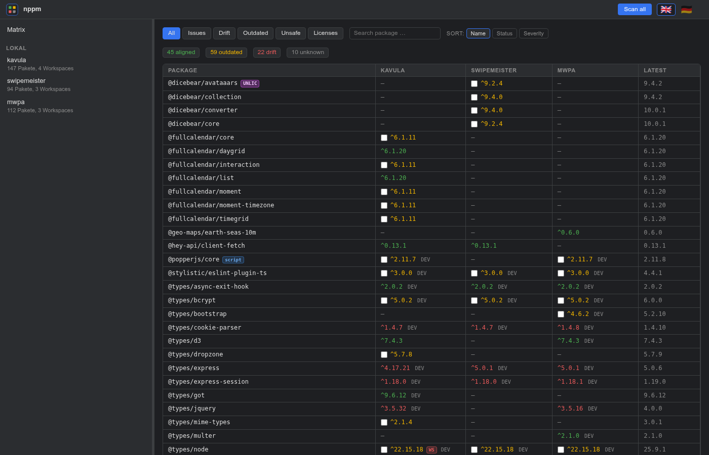

**Filters** at the top-left: `All / Issues / Drift / Outdated / Unsafe /
Licenses` (the last one shows only packages with strong-copyleft,
proprietary, or unknown licenses).
The **search box** does case-insensitive substring matching on the
package name. **Sort:** by name, by status (most urgent first), or by
aggregated security score.

**Badges in the name cell:**

- `CVE N` — N known OSV.dev vulnerabilities for the latest version.
- `SCRIPT` / `SCRIPT!` — lifecycle scripts at warn / risk level.
- `EVAL N` — N dynamic-code-execution patterns in the tarball.
- `BIN N` — N native binaries (`.exe / .dll / .so` …) in the tarball.
- `OWNER!` — quick owner handover on a mature package (classic
  account-takeover profile — see the maintainer scanner below).
- `GPL` / `UNLIC` / `LIC?` — license classification: strong-copyleft /
  proprietary / unknown (see the License tab below).
- `WS` — workspaces within one project disagreed.

**Git-pinned dependencies** show the *installed* version as the cell
value plus a small `git` chip; hovering reveals the original URL.

Clicking a cell opens the [package detail panel](#3-package-detail-panel).
Clicking a project column header drills into that project.

---

## 2. Drilling into one project

Picking a project in the left treeview lands you in an eight-tab project
view: **Declared / Installed / History / Matrix / Tree / Unused / Vulns
/ PR**. The toggle is the same in every tab so navigation is one click
away regardless of where you are.

### 2.1 Declared dependencies

Flat table of every dependency declared in the project's `package.json`
(root + workspaces).

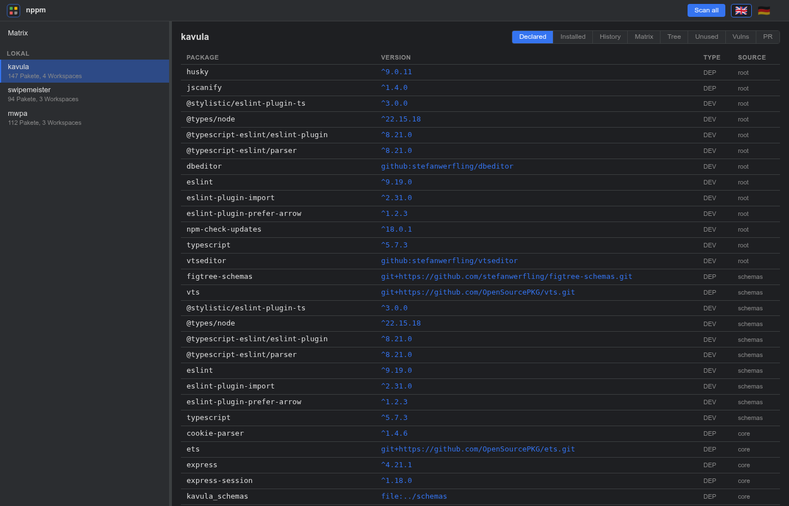

### 2.2 Installed dependencies

What npm actually resolved on disk. The view shows the *source* used:

- **`package-lock.json v3`** — committed lockfile (best fidelity).
- **`node_modules/.package-lock.json v3`** — npm's hidden mirror,
  exactly the same data, written on every `npm install` — used when the
  committed lockfile is gitignored.
- **Generated from `node_modules`** — last-resort flat walk when no
  lockfile exists (no `dev` / `peer` / `optional` flags).

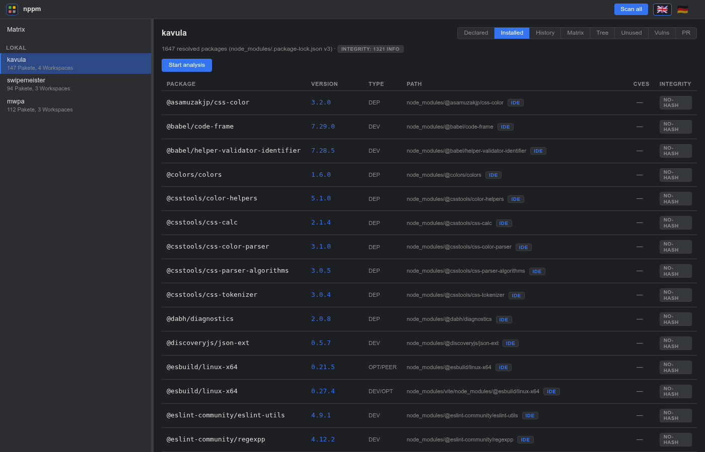

The **Start analysis** button kicks off a per-project SSE-streamed OSV
check; the CVE column fills row-by-row while the progress bar runs.

The **Integrity column** is filled at load time — no button required.
Each row gets one of:

- `✓` — lockfile `integrity + resolved` match what the npm registry
  currently serves (the common case).
- `mismatch` (red) — the registry now serves a different SRI hash than
  the lockfile pinned. Possible mirror-hijack, dependency-confusion,
  or hand-edited lockfile. Hover the pill for the side-by-side hashes.
- `mirror` (grey) — `resolved` URL points off-registry but the
  integrity still matches. Harmless custom mirror.
- `no-hash` (grey) — lockfile entry has no integrity field (old npm,
  hand-edits, git deps).
- `private` (grey) — registry doesn't know this package. Private /
  unpublished / internal.
- `—` (muted) — registry cache hasn't been populated yet; show the
  Declared view once or run a scan to warm it up.

A summary pill (`Integrity: 1 mismatch · 3 info`) appears next to the
meta line when the scan found anything non-trivial; clean projects
stay quiet. The whole check is network-free against the registry
cache that the Declared view + global scan populate.

Each row's path cell gets a small **`IDE`** button when
`actions.editor` is set in `nppm.json`. Clicking it opens
`node_modules/<pkg>` in the configured editor via its URL handler
(`vscode://`, `vscodium://`, `cursor://`, `phpstorm://`, `webstorm://`,
`idea://`, `subl://`). Hidden for remote projects (the files aren't on
your disk) and when no editor is configured.

### 2.3 Per-project matrix

Same shape as the global matrix, but columns are the project's
*workspaces* instead of other projects. Use it when one project's own
workspaces drift.

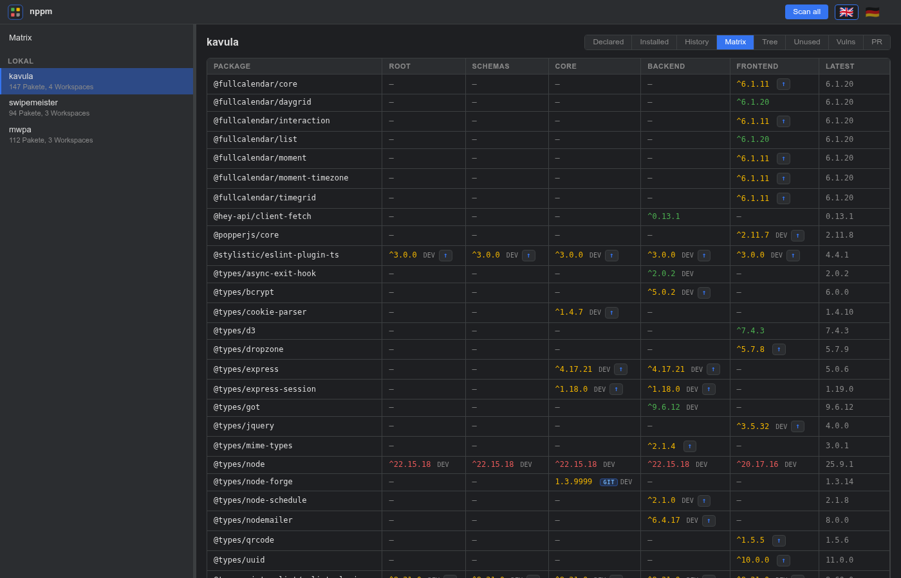

### 2.4 Dependency tree

D3 collapsible tree. Root = the project, children = top-level deps,
expanding any node loads its sub-dependencies on demand. Node colour
matches the status semantics; an outlined node has hidden children left
to expand.

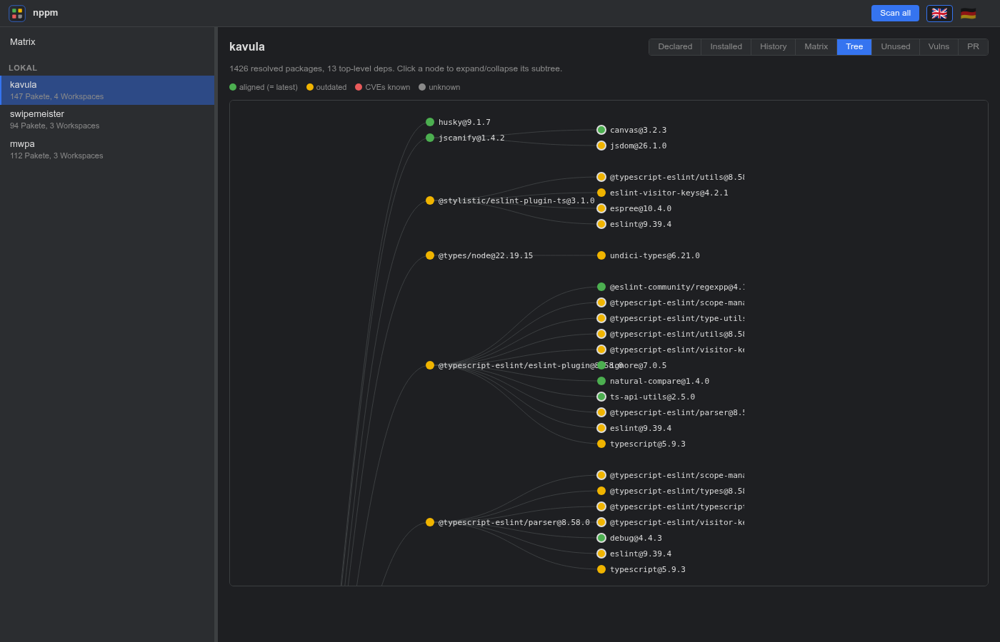

### 2.5 History

Every time nppm loads this project's lockfile, it diffs against the
prior snapshot and appends an entry when anything changed. The reason
field is auto-generated from the semver bump type, with a CVE hint when
the outgoing version had known vulnerabilities in the OSV cache.

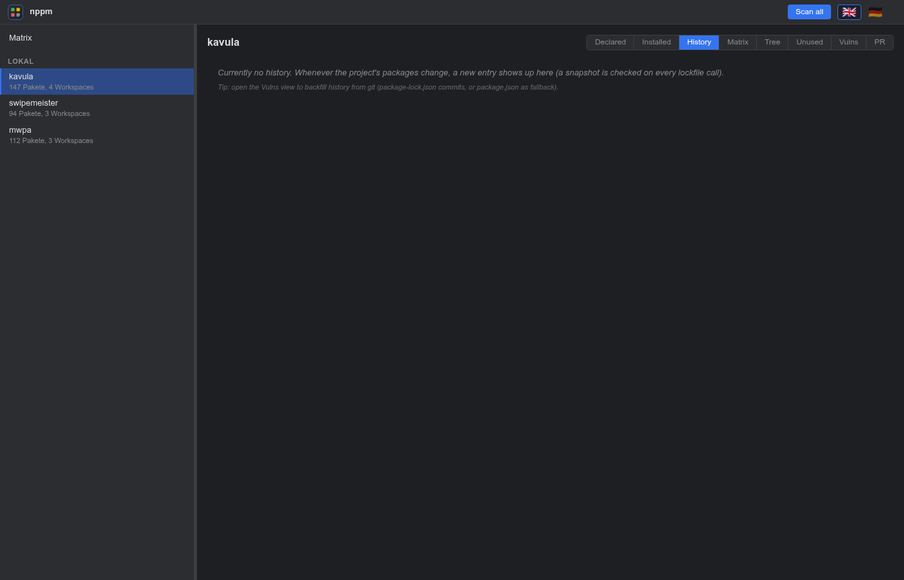

History files live in `.nppm-history/` next to your `nppm.json` — safe
to commit if you want long-term audit trails.

**Git backfill.** The first time you open the [Vulnerability
Timeline](#9-vulnerability-timeline) on a project with a `.git/`
directory, nppm walks `git log -- package-lock.json` and reconstructs
the full dep history retroactively — one entry per commit that
touched the lockfile, with the real commit SHA + author timestamp.
Same code path works for GitHub / Gitea projects via their commits
API. When no lockfile was ever committed, the walker falls back to
`git log -- package.json` and tracks declared-range drift instead;
those entries get a yellow `declared-only` pill in the History view
because the version strings are ranges (`^4.0.0`) rather than concrete
versions, and the Vulns view can't OSV-query them.

The backfill is idempotent by HEAD SHA — re-running the scan after a
few new commits only fetches the new ones; old ones come from the
cache.

### 2.6 Unused dependencies

A depcheck-style hygiene scan of the project's source tree. The tab
groups findings into three lists:

- **Unused** — declared in `package.json` but nothing under `src/`
  imports them. Severity is `risk` for genuine candidates and `info`
  for entries the scanner deliberately spared (allowlist / `scripts:`
  reference / `@types/X` whose `X` is imported).
- **Misplaced** — imported only from dev paths (`*.test.*`,
  `*.spec.*`, `tests/`, `*.config.*`) but listed in `dependencies`
  instead of `devDependencies`. Fix is a `package.json` edit.
- **Missing** — imported from source but not declared anywhere.
  Usually a transitive leak, sometimes a forgotten peer dep.

The scanner is regex-based (no AST parse). Dynamic specs like
`import(varName)` cannot be resolved; affected files are listed
separately so the unused list isn't mistaken for authoritative there.

A default allowlist covers the bin-tools that nearly every npm
project keeps in `devDependencies` (`vite`, `vitest`, `tsx`,
`typescript`, `eslint`, `prettier`, `husky`, `rimraf`, `cross-env`, …)
plus the well-known `tsc → typescript` bin alias. Add your project's
extras via `security.unused.allowlist` in `nppm.json` — the default
list is *unioned*, not replaced, so a one-line override doesn't
re-introduce a wall of false positives.

Remote projects (GitHub / Gitea) currently show "not supported here"
because the contents-API per-file fetch would blow the rate-limit
budget in v1.

---

## 3. Package detail panel

Clicking a matrix cell opens a modal with five tabs.

### 3.1 Files

Per-file SHA-256 + size of every file in the tarball. The header shows
total file count and total bytes.

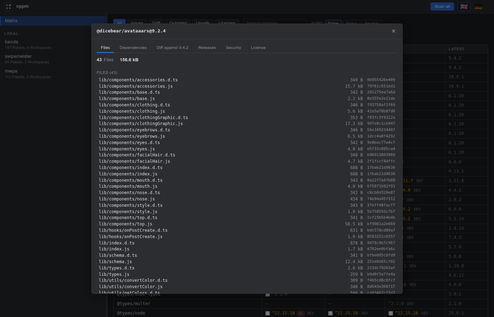

### 3.2 Dependencies

What the package itself declares as `dependencies`, `devDependencies`,
`peerDependencies`, `optionalDependencies`. Pulled directly from the
tarball's `package.json` (cached permanently).

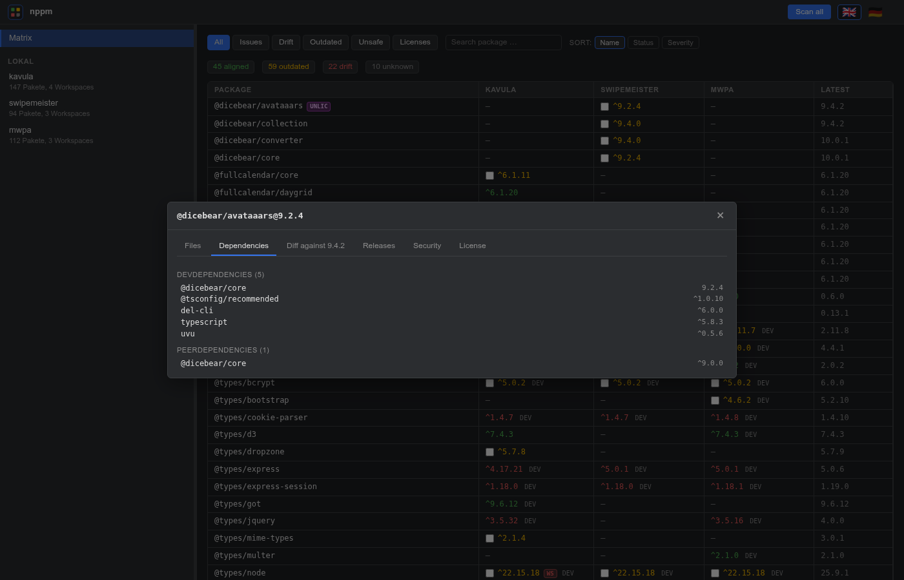

### 3.3 Diff

Compares the cell version against the registry latest, file-by-file:
added / removed / modified. Lazy-loaded the first time the tab opens.

### 3.4 Releases

Merged timeline:

- Registry publish dates (always available)
- Per-version publisher (`_npmUser`) — shown as `by <name>` next to the
  date so owner handovers are visible at a glance in the timeline.
- GitHub release titles + notes (when the package's `repository` field
  points at github.com)

The number on the right is a direct link to the GitHub release page.
Set `GH_TOKEN` in your `.env` to lift the 60 req/h anonymous rate
limit.

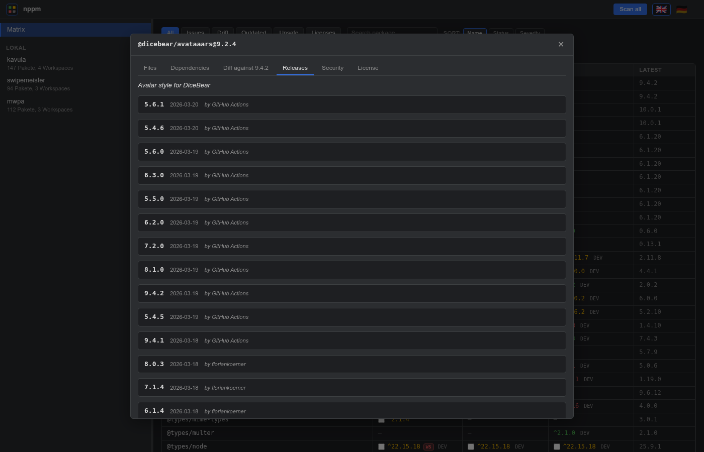

### 3.5 Security

Aggregates six scanners (license has its own tab — see 3.6):

- **CVEs** from OSV.dev (single-version query, deep results)
- **Install-scripts** — lifecycle hooks classified info/warn/risk
- **Code patterns** — `eval(`, `new Function(`, `child_process`, base64
- **Binaries** — native code in the tarball
- **File churn** — comparison against the previous stable version
- **Maintainer / Publisher** — compares the `_npmUser` of the chosen
  version against the trust set of recent predecessors.

The maintainer scanner's severity is driven by **how quickly the owner
changed** on a mature package — the empirical attack pattern (event-
stream, ua-parser-js, coa, rc, @solana/web3.js) is "active project,
sudden new publisher", not "dormant project, new maintainer".

| Gap to previous version | Severity |
|-------------------------|----------|
| ≤ 30 days + ≥10 predecessors | `risk` — takeover profile |
| 31 – 180 days + ≥10 predecessors | `warn` — unusual, worth a look |
| > 180 days | `info` — likely a legitimate community takeover of an abandoned package |

Thresholds are tunable in `nppm.json` under
`security.maintainer.{quickHandoverDays,suspiciousGapDays,matureVersions,trustWindow}`.

When `Maintainer = risk` **and** `Churn = warn/risk` hit the same
release, the panel shows a red **"possible supply-chain attack"**
banner at the top — that is the pattern the real-world takeovers
listed above all shared.

A "git package" note appears for git-installed dependencies because OSV
only indexes registry versions — the other scanners still run normally.

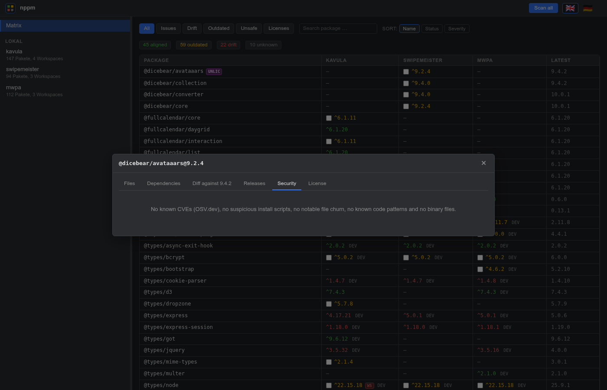

### 3.6 License

A dedicated tab for compliance questions. Classifies the package's
`license` field into five buckets:

| Bucket | Examples | Meaning |
|--------|----------|---------|
| `permissive` | MIT, Apache-2.0, BSD-*, ISC | No obligations |
| `weak-copyleft` | LGPL-*, MPL-2.0, EPL-2.0 | File-level boundary, mostly accepted |
| `strong-copyleft` | GPL-*, AGPL-* | Viral, derivatives must release source |
| `proprietary` | `UNLICENSED`, `SEE LICENSE IN …` | No redistribution without contract |
| `unknown` | not in the SPDX catalogue | Not classifiable — manual review |

A mini SPDX-expression parser handles compound forms like
`(MIT OR Apache-2.0)` (for OR the most permissive bucket wins — the
user gets to pick) and `MIT AND GPL-3.0` (for AND the most restrictive
— all obligations apply). `WITH` clauses
(`Apache-2.0 WITH Classpath-exception-2.0`) don't change the bucket.

The tab also lists the **actual `LICENSE*` / `COPYING*` files shipped
in the tarball** — a cross-check against the manifest's self-report.

**Policy in `nppm.json`:**

```json
"security": {
  "license": {
    "allowlist": ["MIT", "Apache-2.0", "BSD-*", "ISC"],
    "denylist": ["AGPL-*"],
    "treatUnknownAs": "proprietary"
  }
}
```

`allowlist` overrides the bucket to `permissive`, `denylist` to
`proprietary` (denylist wins on conflict). `treatUnknownAs:
"proprietary"` forces any package without a recognised license into
manual review.

---

## 4. Global CVE scan

The **Scan all** button in the topbar opens an SSE stream that walks
every configured project's lockfile, dedupes `name@version` across the
whole set, and queries OSV in chunks of 50. The topbar progress bar
shows both the collection phase and the OSV phase.

Results land in a fifth right-pane view: every unique `name@version`
across all projects, with vuln count and the list of projects that
pulled it in. The **Only issues** checkbox filters down to rows with
known CVEs.

A subsequent scan is instant for any `pkg@version` already in the OSV
cache — only new entries cost a network round-trip.

---

## 5. Headless CI mode

`nppm scan` is the same set of scanners as the dev server but
non-interactive — designed to drop into a CI pipeline.

```sh
nppm scan                              # everything, fail on risk
nppm scan --project=alpha --json       # one project, machine-readable
nppm scan --fail-on=warn               # tighter gate
nppm scan --no-osv --no-heuristics     # offline / lockfile-free
```

What the run does for each configured project (or the `--project=…`
subset):

1. Reads the lockfile and deduplicates `name@version`.
2. Hits OSV.dev for CVE IDs (unless `--no-osv`).
3. Walks the heuristic batch — scripts / patterns / binaries /
   maintainer / license — over the same fingerprint cache the dev
   server populates (unless `--no-heuristics`).
4. Runs the unused-deps detector (unless `--no-unused`).

Every per-scanner severity collapses onto an `info / warn / risk`
ladder; `--fail-on=<level>` sets the threshold for a non-zero exit.
License classifications fold in: `permissive` is silent, weak-copyleft
and unknown surface as `info`, strong-copyleft as `warn`, proprietary
as `risk`. OSV vulnerabilities are uniformly `risk` (matches `npm
audit --audit-level=high`).

Output is human-readable text by default; pass `--json` for a
machine-readable payload or `--sarif` for a SARIF 2.1.0 envelope that
GitHub Code Scanning ingests directly (`actions/upload-sarif`). The
CLI reuses `.nppm-cache/` and `.nppm-history/`, so a warm CI run is
fast: warm OSV + warm fingerprint = no network for already-seen
packages.

Exit codes:

- `0` — clean, or all findings below `--fail-on`
- `1` — at least one finding at or above `--fail-on`
- `2` — usage / config error (bad flag, missing `nppm.json`)

Example GitHub Actions step:

```yaml
- run: npx nppm scan --fail-on=risk --json > nppm-report.json
```

For Code-Scanning ingest:

```yaml
- run: npx nppm scan --fail-on=none --sarif > nppm.sarif
- uses: github/codeql-action/upload-sarif@v3
  with:
    sarif_file: nppm.sarif
```

## 6. SBOM export

`nppm sbom` emits a Software Bill of Materials for one project.
Two formats:

- **CycloneDX 1.6** (default) — OWASP standard, broad security-tool
  ecosystem (Trivy, Dependency-Track, OSV-Scanner).
- **SPDX 2.3** — Linux Foundation, license-/compliance-centric
  (FOSSA, Fossology, SPDX-tools).

```sh
nppm sbom --project=kavula                   # CycloneDX to stdout
nppm sbom --project=kavula --format=spdx     # SPDX 2.3 JSON
nppm sbom --project=kavula --output=bom.json # write to file
```

`--project` is required when more than one project is configured.
Same data is available via REST:

- `GET /api/projects/:id/sbom?format=cyclonedx` — default
- `GET /api/projects/:id/sbom?format=spdx`

Both endpoints set `Content-Type` to the right MIME
(`application/vnd.cyclonedx+json` / `application/spdx+json`) so a
proxy / tool can route by header.

Data sources per package:

| Field | Source |
|-------|--------|
| `name`, `version` | lockfile |
| `purl` | derived from name + version |
| sha512 hash | lockfile `integrity` (base64 → hex) |
| license | registry packument |
| repository | registry packument |
| `dependencies[]` edges | lockfile `dependencies` map |

No fingerprint downloads — SBOM is about identity + provenance, not
tarball contents. A warm registry cache makes the run instant.

---

## 7. Upgrading a dep (Upgrade modal)

Outdated cells in the per-project matrix get a small `↑` button. Click
it to open the Upgrade modal — a focused, per-cell flow:

1. **Plan** — shows which workspace's `package.json` would change.
2. **Target version** — the registry's `dist-tags.latest`. The button
   pre-fills `^<latest>` so the lockfile picks up the new range.
3. **Security heads-up** — one-liner with the worst signals from the
   `SecurityScanner` on the *target* version: CVEs, install scripts,
   maintainer handover, churn. Click through to the package detail
   panel for the full breakdown.
4. **Diff** — the planned `package.json` change with two lines of
   context. Indentation and trailing newline are preserved.
5. **Action**:
   - **Apply edit only** (always available). Writes the file, takes a
     backup to `.nppm-backups/<timestamp>/`, and reminds you to run
     `npm install` by hand.
   - **Apply edit + install (--ignore-scripts)**. Only shown when
     `actions.allowInstall: true` in `nppm.json`. Streams the install
     output live in the modal.

After a successful install, the modal lists every install-time
lifecycle hook found across `node_modules/*` — `preinstall`,
`install`, `postinstall`, `prepare`. For each, you see the script
body verbatim and a manual command (`npm rebuild <pkg>`). When the
gate is open, a per-row **Run** button fires that command via SSE
and streams the output back. Re-running is always explicit per
package; nothing executes third-party code on its own.

```json
"actions": {
  "allowInstall": true
}
```

Security stance: scripts are always disabled by default. Opening the
gate unlocks the *option* to install + re-fire hooks, but each
script run is still a deliberate click. If you'd rather stay in
edit-only mode forever, leave the flag off — nppm becomes a precise
editor and surfaces a `npm install` command for the user to run by
hand.

---

## 8. Bulk-Update Wizard

The per-cell Upgrade modal is great when you've got one outdated dep
to think about. When ten of them piled up across three projects, the
**Bulk-Update Wizard** turns that into one round-trip.

In the **global matrix**, every outdated cell of a *local* project
grows a checkbox next to the version. (Remote projects and git-pinned
deps are skipped — the underlying `Upgrader` only mutates local
files, and git installs have no registry `latest` to bump to.)
Filtering by `Outdated` makes the candidates easier to spot.

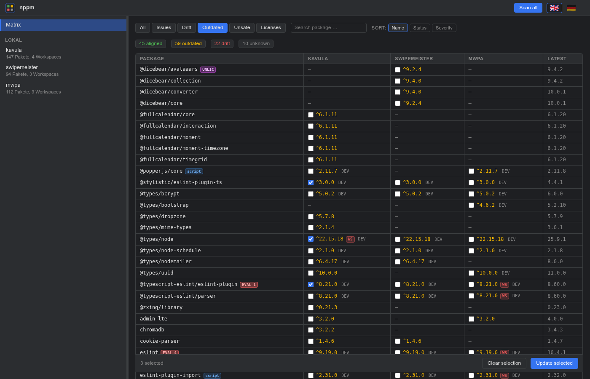

A sticky **footer bar** appears under the table the moment you tick
the first checkbox: live count, **Clear selection**, and the primary
**Update selected** trigger. Selections survive filter / sort changes
within the same page session and clear on the next reload.

Clicking **Update selected** opens the wizard:

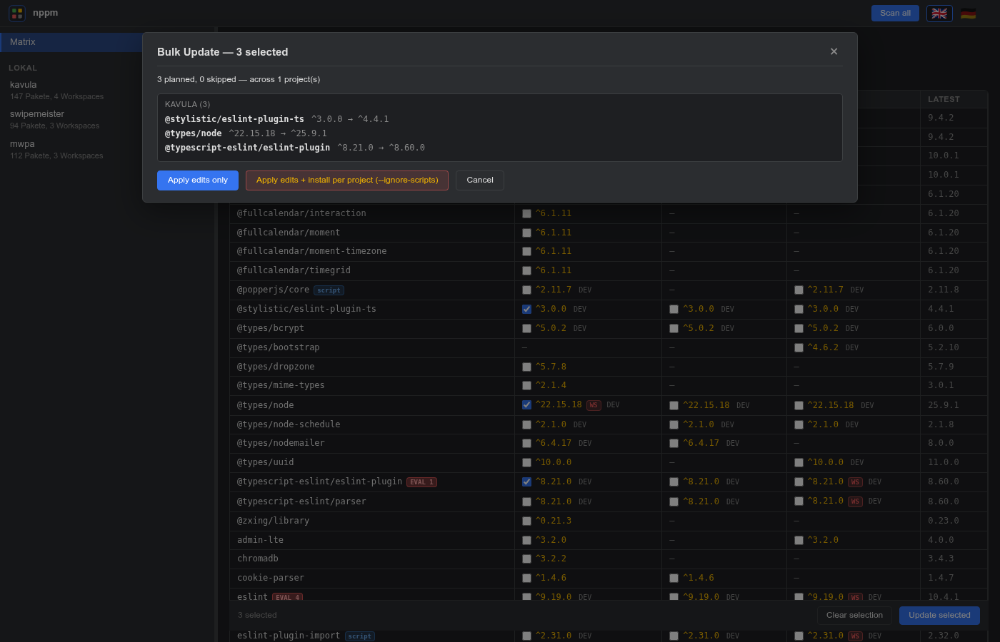

1. **Header** — total picks across all selected cells.
2. **Summary** — `N planned, M skipped — across K project(s)`. Skipped
   buckets are the same as the single-pick API: `not-local`,
   `unknown-project`, `not-found` (the dep aggregates across
   workspaces in the global matrix; if it lives only in a
   non-root workspace, root-level edit can't reach it), `no-change`.
3. **Per-project groups** — each project gets its own card with the
   ticked picks. Each row shows `name`, the planned `from → to`
   range, and a one-liner with the worst security signals on the
   target version (CVE count, install-scripts, maintainer / churn /
   license).
4. **Skipped list** at the bottom — every pick that couldn't be
   planned, with its reason, so nothing silently disappears.
5. **Actions**:
   - **Apply edits only** — writes every changed `package.json`, one
     shared backup folder per project under
     `.nppm-backups/<timestamp>/`, then reminds you to run `npm
     install` by hand in each project.
   - **Apply edits + install per project (--ignore-scripts)** —
     same plus a sequential install. One `npm install` per project,
     never in parallel (the npm cache lock would race). Streams the
     output of all installs live into one combined log.

The live log groups events per project:

```
── kavula (3 picks) ──
  ✓ Backup saved to .nppm-backups/2026-05-29T11-15-02Z
    · package.json
    · package-lock.json
  ✓ vitest → package.json
  ✓ vite → package.json
  ✓ typescript → package.json

  $ npm install --ignore-scripts --no-audit --no-fund
    (cwd: /home/swe/Dokumente/Projekte/pkg/kavula)

  …
  Install finished (exit 0)

── swipemeister (2 picks) ──
  ...
```

A failed install in one project surfaces as `error` but doesn't abort
the next project — partial success is recoverable via the backup
folders.

The wizard does **not** offer a "Run lifecycle scripts" step (the
single-package modal does). If you need to re-fire scripts after a
bulk upgrade, open the affected packages individually via the per-
project matrix and use the existing per-script Run button.

> 💡 **Tip:** combine the `Outdated` filter with the search box to
> bulk-update just one ecosystem at a time — e.g. type `vite` to
> sweep up `vite`, `vitest`, `@vitejs/*` across every project.

---

## 9. Vulnerability Timeline

> "From when to when was this project exposed to which CVE?"

The **Vulns** tab inside the project view answers that question with
data nppm already has: per-project history snapshots, OSV cached
records, and (for new findings) the OSV `published` date.

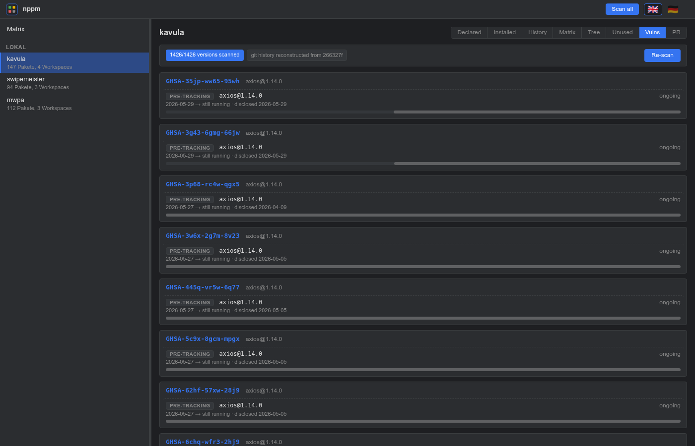

The view sorts every (CVE, `name@version`, interval) triple into
exposure cards, longest exposure first. Each row shows:

- **`name@version`** — the package version that was sitting in your
  project during the exposure window.
- **Classification badge:**
  - 🔴 `known-at-install` — the CVE was already public on OSV at the
    moment this version entered the project. You installed a
    known-vulnerable version.
  - 🟡 `disclosed-during-use` — the CVE was filed *while* the version
    was already in use. Retroactive exposure.
  - ⚪ `pre-tracking` — the version was present before nppm had
    history for the project; the lower-bound timestamp is the
    earliest known one, not a true install date.
- **`from → to`** — exposure window start / end. `still running` when
  this version is currently installed.
- **Disclosure date** — when OSV recorded the vulnerability.
- **Coloured bar** — visual exposure timeline against the project's
  history range.

The header shows coverage (`scanned / total versions`) and the git
backfill watermark (the HEAD SHA the last walk consumed). When the
project is fresh (no backfill yet) or the OSV cache has gaps, the
view fires a **Scan** SSE automatically: first git-backfill phase,
then OSV catch-up. Subsequent opens are instant from cache.

Click any row to jump into the [package detail panel](#3-package-detail-panel)
landing on the Security tab — the bridge between the timeline and
the per-package deep dive.

Click on a GHSA-id in the card header to open the official OSV.dev
vulnerability page for full context.

This is the compliance-grade signal: a 12-month exposure report per
project that no other npm tool emits, because no other npm tool pins
history to disk.

---

## 10. PR Review

> "What does this branch actually change in the lockfile, and is the
> CVE balance better or worse?"

The **PR** tab diffs `package.json` + `package-lock.json` between two
git refs (default `main` vs `HEAD`) and renders one card per changed
dep with the CVE delta.

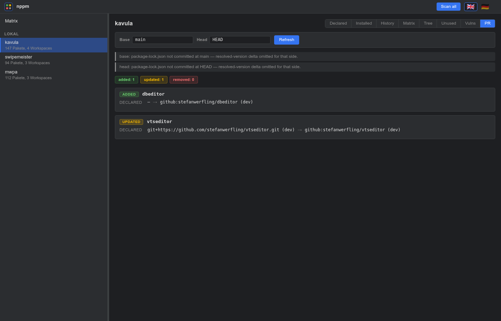

The header carries two input fields — **Base** and **Head** — plus a
**Refresh** button. Type any ref that resolves locally (branch,
tag, SHA, `HEAD~3`, …). Empty falls back to the defaults.

Summary pills at the top:

- `added: N`, `updated: N`, `removed: N`, `bucket: N` — counts per
  change kind.
- `+N CVE` (red) — new exposures the head branch *introduces*.
- `−N CVE` (green) — exposures the head branch *closes*.

Each card shows:

- **Change-kind badge** — `ADDED` (green), `UPDATED` (yellow),
  `REMOVED` (red), `BUCKET` (grey, e.g. `dependencies` →
  `devDependencies`).
- **Declared transition** — `^1.0.0 (dependency) → ^2.0.0 (dependency)`
  from `package.json`.
- **Resolved transition** — `1.0.5 → 2.0.3` from `package-lock.json`,
  if both sides have a committed lockfile.
- **CVE delta rows** —
  - 🔴 `New exposures (N)` — GHSA pills for vulns the head version
    adds that the base version didn't have.
  - 🟢 `Closed by this PR (N)` — GHSA pills for vulns the base
    version had that the head version no longer carries.

Click the card head to jump into the [package detail panel](#3-package-detail-panel)
on the Security tab for the new resolved version. Click a GHSA pill
to open the OSV.dev page directly.

**Scope note:** V1 surfaces the CVE delta only. Maintainer-change /
install-script / pattern delta would each require a tarball fetch
per side; deferred to a later SSE-driven endpoint. Local projects
only — remote (GitHub / Gitea) PR review would need the same git-show
API the backfill walker uses.

---

## 11. Switching language

The flags in the top-right corner switch the UI language. Default is
English, German is shipped. Adding a third language is a three-step
edit — see [`CLAUDE.md`](../CLAUDE.md) for the procedure.

Language choice is remembered in `localStorage` (`nppm.lang`) and
applies on the next page load.